# RBF-Gen クラス図

```mermaid
classDiagram

%% ─── カーネル関数 ───────────────────────────────────────
class Kernel {
    <<abstract>>
    +__call__(r: Tensor) Tensor
}
class GaussianKernel {
    +epsilon: float
    +__call__(r: Tensor) Tensor
}
class ThinPlateSplineKernel {
    +__call__(r: Tensor) Tensor
}
Kernel <|-- GaussianKernel
Kernel <|-- ThinPlateSplineKernel

%% ─── RBF基底 ────────────────────────────────────────────
class RBFBasis {
    +centers: Tensor          # (K, d)
    +kernel: Kernel
    +from_uniform(K, bounds, kernel) RBFBasis$
    +from_quasi_random(K, bounds, kernel) RBFBasis$
    +compute_matrix(X: Tensor) Tensor   # (N, K)
    +compute_vector(x: Tensor) Tensor   # (K,)
}
RBFBasis --> Kernel

%% ─── 零空間分解 ─────────────────────────────────────────
class NullSpaceDecomposition {
    +w0: Tensor               # (K,)  最小ノルム特解
    +null_basis: Tensor       # (K, K-N)  零空間基底
    +fit(Phi: Tensor, y: Tensor) void
    -_compute_via_svd(Phi, y) void
}

%% ─── ジェネレーター ─────────────────────────────────────
class Generator {
    <<nn.Module>>
    +latent_dim: int          # z の次元
    +null_dim: int            # K-N
    +hidden_dims: list[int]
    +forward(z: Tensor) Tensor  # (B, K-N)
}

%% ─── RBFGen モデル（統合） ──────────────────────────────
class RBFGenModel {
    +rbf_basis: RBFBasis
    +null_decomp: NullSpaceDecomposition
    +generator: Generator
    +forward(x: Tensor, z: Tensor) Tensor   # f_z(x)
    +predict_mean(x: Tensor, n_samples: int) Tensor
    +predict_std(x: Tensor, n_samples: int) Tensor
    +sample_z(batch_size: int) Tensor
}
RBFGenModel --> RBFBasis
RBFGenModel --> NullSpaceDecomposition
RBFGenModel --> Generator

%% ─── ペナルティ項 ───────────────────────────────────────
class PenaltyTerm {
    <<abstract>>
    +weight: float
    +__call__(f_z: Tensor, grid: Tensor) Tensor
}
class MonotonicityPenalty {
    +dim: int
    +increasing: bool
    +__call__(f_z, grid) Tensor   # Eq.(14)
}
class PositivityPenalty {
    +lower_bound: float
    +__call__(f_z, grid) Tensor   # Eq.(15)
}
class LipschitzPenalty {
    +L: float
    +__call__(f_z, grid) Tensor   # Eq.(16)
}
class SmoothnessPenalty {
    +__call__(f_z, grid) Tensor   # Eq.(17)
}
class ConvexityPenalty {
    +convex: bool
    +__call__(f_z, grid) Tensor   # Eq.(18)
}
class BoundaryPenalty {
    +boundary_points: Tensor
    +boundary_values: Tensor
    +__call__(f_z, grid) Tensor   # Eq.(19)
}
PenaltyTerm <|-- MonotonicityPenalty
PenaltyTerm <|-- PositivityPenalty
PenaltyTerm <|-- LipschitzPenalty
PenaltyTerm <|-- SmoothnessPenalty
PenaltyTerm <|-- ConvexityPenalty
PenaltyTerm <|-- BoundaryPenalty

%% ─── KL発散項 ───────────────────────────────────────────
class KLDivergenceTerm {
    <<abstract>>
    +weight: float
    +target_mean: float
    +target_std: float
    +__call__(f_z_batch: Tensor) Tensor
    #_gaussian_kl(samples: Tensor) Tensor
}
class PointValueKL {
    +x0: Tensor
    +__call__(f_z_batch) Tensor   # Eq.(20)
}
class RegionalAverageKL {
    +region_points: Tensor
    +__call__(f_z_batch) Tensor   # Eq.(21)
}
class ExtremalValueKL {
    +region_points: Tensor
    +use_max: bool
    +__call__(f_z_batch) Tensor   # Eq.(22)
}
class GradientMagnitudeKL {
    +x0: Tensor
    +__call__(f_z_batch) Tensor   # Eq.(23)
}
class CurvatureKL {
    +x0: Tensor
    +dim: int
    +__call__(f_z_batch) Tensor   # Eq.(24)
}
KLDivergenceTerm <|-- PointValueKL
KLDivergenceTerm <|-- RegionalAverageKL
KLDivergenceTerm <|-- ExtremalValueKL
KLDivergenceTerm <|-- GradientMagnitudeKL
KLDivergenceTerm <|-- CurvatureKL

%% ─── 損失関数（統合） ───────────────────────────────────
class RBFGenLoss {
    +penalty_terms: list[PenaltyTerm]
    +kl_terms: list[KLDivergenceTerm]
    +__call__(model, eval_grid, batch_size) Tensor  # Eq.(13)
}
RBFGenLoss --> PenaltyTerm
RBFGenLoss --> KLDivergenceTerm

%% ─── トレーナー ─────────────────────────────────────────
class RBFGenTrainer {
    +model: RBFGenModel
    +loss_fn: RBFGenLoss
    +optimizer: Optimizer
    +n_epochs: int
    +batch_size: int
    +train() void
    +_train_step() Tensor
}
RBFGenTrainer --> RBFGenModel
RBFGenTrainer --> RBFGenLoss
```



---

## モジュールとクラスの対応

| ファイル | クラス |
|---|---|
| `kernels.py` | `Kernel`, `GaussianKernel`, `ThinPlateSplineKernel` |
| `rbf.py` | `RBFBasis` |
| `null_space.py` | `NullSpaceDecomposition` |
| `generator.py` | `Generator` |
| `model.py` | `RBFGenModel` |
| `losses.py` | `PenaltyTerm` 系, `KLDivergenceTerm` 系, `RBFGenLoss` |
| `trainer.py` | `RBFGenTrainer` |

## データフロー

```
学習時:
  (X, y) → RBFBasis.compute_matrix() → Φ
  Φ, y  → NullSpaceDecomposition.fit() → w0, null_basis
  z ~ N(0,I) → Generator.forward() → α
  Φ(x), w0, null_basis, α → f_z(x) = Φ(x)ᵀ(w0 + N·α)
  f_z → RBFGenLoss → L_gen → 逆伝播 → Generator のパラメータ更新

推論時:
  z^(1..B) ~ N(0,I) → アンサンブル {f_z^(b)(x)}
  → 平均: サロゲート予測値
  → 分散: 不確実性推定
```
