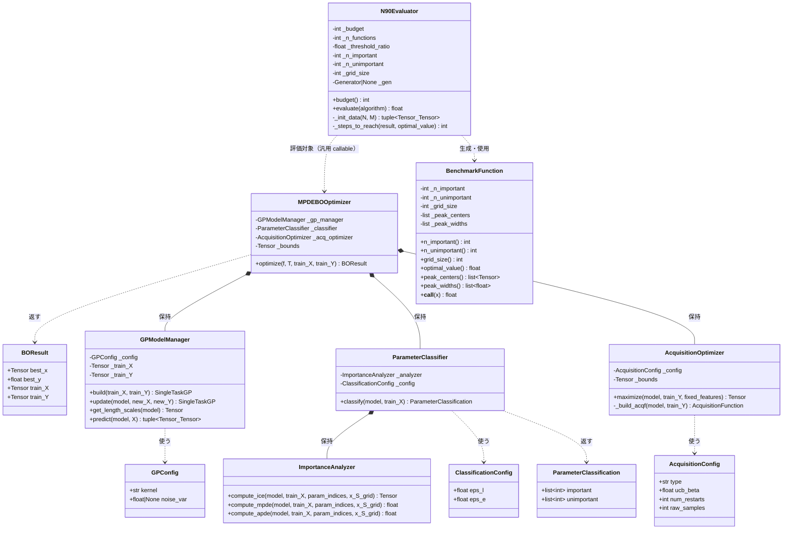

# MPDE-BO クラス設計

本ドキュメントでは、[api_design.md](api_design.md) で定義した関数群を
クラスとして整理し、責務の分担を定義する。

---

## 設計方針

- **SOLID 原則を基本とする**が、遵守することで不必要に複雑になる箇所は簡略化する
- BoTorch / GPyTorch はすでに抽象化が整っているため、**カーネルや獲得関数の独自抽象クラスは設けない**
  - `str` / `Enum` によるパラメータ指定で十分 → インターフェース分離の徹底より可読性を優先
- 論文固有の計算（ICE / MPDE / パラメータ分類）と BoTorch の標準機能を明確に分離する

---

## クラス一覧と責務

| クラス                 | 責務                                        | SOLID との関係        |
| ---------------------- | ------------------------------------------- | --------------------- |
| `MPDEBOOptimizer`      | アルゴリズム全体のオーケストレーション      | SRP: ループ制御のみ   |
| `GPModelManager`       | GP モデルの構築・更新・ARD 長さスケール取得 | SRP: GP 状態管理のみ  |
| `ImportanceAnalyzer`   | ICE / MPDE / APDE の計算（論文固有）        | SRP: 重要度計算のみ   |
| `ParameterClassifier`  | ARD + MPDE の閾値処理によるパラメータ分類   | SRP: 分類ロジックのみ |
| `AcquisitionOptimizer` | 獲得関数の生成と最大化                      | SRP: 最適化のみ       |
| `BenchmarkFunction`    | 論文のモデル目的関数の生成と評価            | SRP: テスト関数のみ   |
| `N90Evaluator`         | N90 評価指標の計算                          | SRP: 評価のみ         |

---

## クラス図



---

## 各クラスの詳細

### `MPDEBOOptimizer`

**責務**: アルゴリズム（method.md §6 ステップ 1–12）のループ制御のみ。
各ステップの処理は委譲先クラスに任せ、自身は順序と結合のみを担う。

```
optimize(f, T, train_X, train_Y):
    model = _gp_manager.build(train_X, train_Y)
    for t in 1..T:
        cls = _classifier.classify(model, train_X)    # ステップ 3-5
        fixed = sample_unimportant(cls.unimportant, _bounds)  # ステップ 7
        x_new = _acq_optimizer.maximize(model, train_Y, fixed)  # ステップ 6
        y_new = f(x_new)                               # ステップ 8-9
        train_X, train_Y = append(train_X, x_new), append(train_Y, y_new)
        model = _gp_manager.update(model, x_new, y_new)  # ステップ 10
    return BOResult(...)
```

**簡略化の理由**: `sample_unimportant` はステートレスな1行処理のため、
独立クラスにせず `optimize` 内のユーティリティ関数として扱う。

---

### `GPModelManager`

**責務**: `SingleTaskGP` の構築・フィッティング・更新、および GP 内部状態（ARD 長さスケール、事後分布）へのアクセスインターフェース。

| メソッド            | 対応ステップ | 内部で呼ぶ BoTorch API                       |
| ------------------- | ------------ | -------------------------------------------- |
| `build`             | ステップ 1   | `SingleTaskGP`, `fit_gpytorch_mll`           |
| `update`            | ステップ 10  | `SingleTaskGP`, `fit_gpytorch_mll`           |
| `get_length_scales` | ステップ 3   | `model.covar_module.base_kernel.lengthscale` |
| `predict`           | ICE 計算時   | `model.posterior(X).mean / .variance`        |

**`GPConfig`** はカーネル種別（`"matern52"` / `"rbf"`）とノイズ分散を保持する
シンプルな dataclass。BoTorch 側のカーネルクラスへの変換は `build` 内で行う。

**内部状態 (`_train_X`, `_train_Y`)**: `update` で再構築するときに前回の訓練データを参照する必要があるため、
`build`/`update` 呼び出し後に最新の訓練データを内部保持する。

---

### `ImportanceAnalyzer`

**責務**: method.md §5 の ICE / MPDE / APDE を計算する。
論文固有の計算であり、BoTorch の標準機能を使わないため独立して設ける。

| メソッド       | 数式                              | 備考                             |
| -------------- | --------------------------------- | -------------------------------- |
| `compute_ice`  | ICE^i(x_S) = f̂(x_S, x_C^i)        | GP 予測平均を n×g グリッドで計算 |
| `compute_mpde` | e_S* = max_i [max - min] over ICE | ステップ 4 の核心                |
| `compute_apde` | ê_S = max - min over 平均 ICE     | 比較用、MPDE-BO 本体では不使用   |

**ステートレス設計**: モデルと観測データを引数で受け取る pure な計算クラス。
インスタンス変数を持たないため、可視化ツールや比較実験からも単独で利用できる。

---

### `ParameterClassifier`

**責務**: ARD 長さスケールと MPDE の値を閾値で比較し、
各パラメータを重要 / 非重要に分類する（method.md §6 ステップ 5）。

```
classify(model, train_X):
    lengths = model.covar_module.base_kernel.lengthscale.squeeze(0).detach()
    for i in 0..N:
        mpde_i = _analyzer.compute_mpde(model, train_X, [i])
        if lengths[i] < eps_l and mpde_i > eps_e:
            → important
        else:
            → unimportant
```

**長さスケールの取得**: `GPModelManager.get_length_scales` への委譲ではなく、
`model.covar_module.base_kernel.lengthscale` を直接参照する。
`ParameterClassifier` は `GPModelManager` インスタンスを持たず、
モデルオブジェクトからデータを取得するのが自然なため。

**`ImportanceAnalyzer` との分離理由（SRP）**:
`ImportanceAnalyzer` は「数値を計算する」責務、
`ParameterClassifier` は「数値から判定する」責務であり、
閾値の変更が `ImportanceAnalyzer` に影響しないようにする。

---

### `AcquisitionOptimizer`

**責務**: BoTorch の獲得関数を生成し、`optimize_acqf` で最大化する。
非重要次元を `fixed_features` で固定することで、MPDE-BO の探索空間分割を実現する。

```
maximize(model, train_Y, fixed_features):
    acqf = _build_acqf(model, train_Y)   # EI / UCB / PI を生成
    ff = fixed_features if fixed_features else None
    candidate, _ = optimize_acqf(
        acqf, bounds=_bounds, q=1,
        fixed_features=ff,               # 非重要次元を固定
        num_restarts=..., raw_samples=...
    )
    return candidate.squeeze(0)           # shape (N,)
```

**`fixed_features` について**: `optimize_acqf` の `fixed_features: dict[int, float]` パラメータを使用する
（`fixed_features_list` ではない）。空辞書の場合は `None` を渡して通常の最適化を行う。

| 獲得関数 | BoTorch クラス             | パラメータ             |
| -------- | -------------------------- | ---------------------- |
| `"EI"`   | `LogExpectedImprovement`   | `best_f=train_Y.max()` |
| `"UCB"`  | `UpperConfidenceBound`     | `beta=ucb_beta`        |
| `"PI"`   | `ProbabilityOfImprovement` | `best_f=train_Y.max()` |

**独自抽象クラスを設けない理由**: 3種類の選択肢を `_build_acqf` 内の分岐で処理するのが最もシンプル。
BoTorch の `AcquisitionFunction` 基底クラスが既に十分な抽象化を提供しており、
これをラップする独自プロトコルは複雑さのみを増す。

---

### `BenchmarkFunction`

**責務**: method.md §7 のモデル目的関数を保持し、呼び出しを提供する。
`__call__` を実装することで `Callable[[Tensor], float]` として振る舞い、
`MPDEBOOptimizer.optimize` の `f` 引数に直接渡せる。

`optimal_value` プロパティを持ち、N90 評価時の真の最適値比較に使用する。

---

### `N90Evaluator`

**責務**: method.md §8 の N90 指標を計算する。
`algorithm` は `(f, T, train_X_init, train_Y_init) -> BOResult` のシグネチャを持つ任意の callable を受け取るため、MPDE-BO と比較手法を同一インターフェースで評価できる。

```
evaluate(algorithm):
    trials = []
    for _ in n_functions:
        f = BenchmarkFunction(...)
        result = algorithm(f, budget, init_X, init_Y)
        t_90 = min{t : result.train_Y[:t].max() >= 0.9 * f.optimal_value}
        trials.append(t_90)
    return percentile(trials, 90)
```

---

## SOLID 原則の適用まとめ

| 原則                       | 適用箇所                                                           | 簡略化した箇所                                              |
| -------------------------- | ------------------------------------------------------------------ | ----------------------------------------------------------- |
| **S** 単一責務             | 全クラス（各クラス 1 責務）                                        | `sample_unimportant` は独立クラス化せず `optimize` 内に置く |
| **O** 開放/閉鎖            | `AcquisitionConfig.type` で獲得関数を追加可能                      | 独自 `AcquisitionFunction` プロトコルは作らない             |
| **L** リスコフ置換         | `N90Evaluator` が任意の callable を受け取れる                      | —                                                           |
| **I** インターフェース分離 | `ImportanceAnalyzer` を `ParameterClassifier` から分離             | カーネルの独自プロトコルは作らない（BoTorch の型で十分）    |
| **D** 依存性逆転           | `MPDEBOOptimizer` はコンストラクタで各サブコンポーネントを受け取る | 全面的な DI コンテナは使わない                              |
