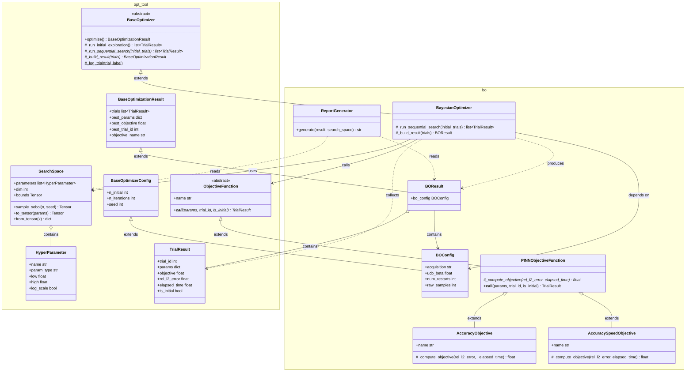

# 仕様書：BoTorch ベイズ最適化によるニューラルネットワークハイパーパラメータチューニング

## 1. 概要

**目的**：`BurgersPINNSolver.solve_forward()` のニューラルネットワーク部分のハイパーパラメータを、BoTorch（GPyTorch ベース）によるガウス過程ベイズ最適化で効率的に探索する。

**最適化対象**：`NetworkConfig` および `TrainingConfig` の一部パラメータ

**目的関数**（使用するクラスにより選択）：

| クラス | 計算式 | 意味 |
|--------|--------|------|
| `AccuracyObjective` | $\text{objective} = -e_{\text{rel}}$ | 精度のみ最大化（L2 誤差を最小化） |
| `AccuracySpeedObjective` | $\text{objective} = \dfrac{1}{e_{\text{rel}}(h) \cdot T(h)}$ | 精度と速度の両立を最大化 |

- $e_{\text{rel}}$：テストデータに対する相対 L2 誤差（低いほど良い）
- $T$：学習にかかった経過時間 [秒]（低いほど良い）
- objective が **高いほど** 良い結果を意味する

ベイズ最適化はこの `objective` を **最大化** する方向で探索する。

---

## 2. 探索空間（ハイパーパラメータ）

| パラメータ名 | 対応する設定クラス | 型 | 探索範囲 | スケール | 説明 |
|------------|-----------------|-----|---------|---------|------|
| `n_hidden_layers` | `NetworkConfig` | int | [2, 8] | linear | 隠れ層数 L |
| `n_neurons` | `NetworkConfig` | int | [10, 100] | linear | 各層のニューロン数 N |
| `lr` | `TrainingConfig` | float | [1e-4, 1e-2] | log | Adam 学習率 |
| `epochs_adam` | `TrainingConfig` | int | [500, 5000] | linear | Adam フェーズのエポック数 |

**固定パラメータ（チューニング対象外）**：

| パラメータ | 固定値 | 理由 |
|-----------|--------|------|
| `nu` | 0.01/π | 順問題の真値 |
| `n_u` | 100 | 論文の設定値 |
| `n_f` | 10,000 | 論文の設定値 |
| `epochs_lbfgs` | 50 | BO の実行時間制御のため固定 |
| 活性化関数 | tanh | 論文で固定 |

---

## 3. モジュール構成

```
src/opt_tool/               # 共通基盤（bo / opt_agent 双方が依存）
├── __init__.py             # パブリック API のエクスポート
├── base.py                 # BaseOptimizerConfig, BaseOptimizationResult, BaseOptimizer
├── objective.py            # ObjectiveFunction ABC
├── result.py               # TrialResult（Pydantic モデル）
├── space.py                # HyperParameter, SearchSpace（Pydantic モデル）
└── report_utils.py         # 共通 Markdown レポートユーティリティ

src/bo/                     # BO 固有の実装
├── __init__.py             # パブリック API のエクスポート
├── objective.py            # PINNObjectiveFunction, AccuracyObjective, AccuracySpeedObjective
├── optimizer.py            # BayesianOptimizer（BoTorch を使用したメインループ）
├── report.py               # ReportGenerator（マークダウンレポートの生成）
└── result.py               # BOConfig, BOResult
```

BoTorch が GP サロゲートと獲得関数を提供するため、`surrogate.py` と `acquisition.py` は不要。

### パブリック API（`src/bo/__init__.py` からのエクスポート）

```python
from bo import (
    SearchSpace,
    HyperParameter,
    ObjectiveFunction,
    AccuracyObjective,
    AccuracySpeedObjective,
    BayesianOptimizer,
    BOConfig,
    BOResult,
    TrialResult,
    ReportGenerator,
)
```

`SearchSpace`, `HyperParameter`, `ObjectiveFunction`, `TrialResult` は `opt_tool` から後方互換のために再エクスポートしている。

---

## 4. クラス設計

### 4-1. クラス一覧

| クラス名 | 種別 | 所在モジュール | 責務 |
|---------|------|--------------|------|
| `HyperParameter` | Pydantic モデル（frozen） | `opt_tool` | 1つのハイパーパラメータの定義（名前・型・範囲・スケール）を保持する |
| `SearchSpace` | Pydantic モデル（frozen） | `opt_tool` | ハイパーパラメータ群の定義と、BoTorch テンソルへの変換・逆変換を担う |
| `TrialResult` | Pydantic モデル（frozen） | `opt_tool` | 1回の試行結果（ハイパーパラメータ値・目的関数値・精度・実行時間）を保持する |
| `ObjectiveFunction` | 抽象クラス（ABC） | `opt_tool` | 目的関数の共通インターフェース（`name` プロパティ・`__call__` メソッド） |
| `BaseOptimizerConfig` | dataclass（frozen） | `opt_tool` | 共通の最適化設定（`n_initial`, `n_iterations`, `seed`）を保持する |
| `BaseOptimizationResult` | dataclass（frozen） | `opt_tool` | 共通の最適化結果フィールドを保持する（`trials`, `best_params` 等） |
| `BaseOptimizer` | 抽象クラス（ABC） | `opt_tool` | Template Method パターンで 3 フェーズ最適化の骨格を提供する |
| `BOConfig` | dataclass（frozen） | `bo` | BO 固有の設定値（獲得関数種別・`num_restarts` 等）を保持する。`BaseOptimizerConfig` を継承 |
| `BOResult` | dataclass（frozen） | `bo` | BO 全体の結果を保持する。`BaseOptimizationResult` を継承し `bo_config` を追加 |
| `PINNObjectiveFunction` | 具象基底クラス | `bo` | PINN 学習・評価の共通ロジックを実装した中間クラス。`_compute_objective` を抽象メソッドとして定義 |
| `AccuracyObjective` | 具象クラス | `bo` | `PINNObjectiveFunction` のサブクラス。精度のみ最大化（objective = -rel_l2_error） |
| `AccuracySpeedObjective` | 具象クラス | `bo` | `PINNObjectiveFunction` のサブクラス。精度と速度の両立を最大化 |
| `BayesianOptimizer` | 具象クラス | `bo` | `BaseOptimizer` を継承。BoTorch の `SingleTaskGP` + `optimize_acqf` を用いた BO メインループを実行する |
| `ReportGenerator` | 具象クラス | `bo` | `BOResult` を受け取り、マークダウン形式のレポートファイルを生成する |

---

### 4-2. 各クラスの定義

#### `HyperParameter`（`opt_tool/space.py`）

**種別**：Pydantic モデル（frozen）
**責務**：1つのハイパーパラメータの名前・型・探索範囲・スケールを保持する

```python
from pydantic import BaseModel, Field, ConfigDict
from typing import Literal

class HyperParameter(BaseModel):
    model_config = ConfigDict(frozen=True)

    name: str
    param_type: Literal["int", "float"]
    low: float
    high: float
    log_scale: bool = False
```

---

#### `SearchSpace`（`opt_tool/space.py`）

**種別**：Pydantic モデル（frozen）
**責務**：ハイパーパラメータ群の定義と、BoTorch が要求する `[0, 1]^d` への正規化変換・逆変換を担う

```python
class SearchSpace(BaseModel):
    model_config = ConfigDict(frozen=True)

    parameters: list[HyperParameter]

    @property
    def dim(self) -> int: ...

    @property
    def bounds(self) -> torch.Tensor: ...  # shape (2, dim), all values in [0, 1]

    def sample_sobol(self, n: int, seed: int) -> torch.Tensor: ...  # (n, dim)

    def to_tensor(self, params: dict[str, float | int]) -> torch.Tensor: ...  # (1, dim)

    def from_tensor(self, x: torch.Tensor) -> dict[str, float | int]: ...
```

**正規化規則**：

| スケール | 正規化（`to_tensor`） | 逆正規化（`from_tensor`） |
|---------|---------------------|------------------------|
| linear | $x' = (x - l) / (h - l)$ | $x = x' \cdot (h - l) + l$ |
| log | $x' = (\log x - \log l) / (\log h - \log l)$ | $x = \exp(x' \cdot (\log h - \log l) + \log l)$ |

正規化後はすべてのパラメータが $[0, 1]$ に収まり、BoTorch の `SingleTaskGP` の `input_transform=Normalize(d)` は不使用（手動正規化で統一）。

---

#### `BaseOptimizerConfig`（`opt_tool/base.py`）

**種別**：dataclass（frozen）
**責務**：共通の最適化設定フィールドを保持する。サブクラスがアルゴリズム固有フィールドを追加する

```python
@dataclass(frozen=True)
class BaseOptimizerConfig:
    n_initial: int = 5
    n_iterations: int = 20
    seed: int = 42
```

---

#### `BOConfig`（`bo/result.py`）

**種別**：dataclass（frozen）。`BaseOptimizerConfig` を継承
**責務**：ベイズ最適化の設定値を保持する

```python
@dataclass(frozen=True)
class BOConfig(BaseOptimizerConfig):
    # n_initial, n_iterations, seed は BaseOptimizerConfig から継承
    acquisition: Literal["EI", "UCB"] = "EI"
    ucb_beta: float = 2.0
    num_restarts: int = 10
    raw_samples: int = 512
```

---

#### `TrialResult`（`opt_tool/result.py`）

**種別**：Pydantic モデル（frozen）
**責務**：1回の試行（ハイパーパラメータ評価）の結果を保持する

```python
class TrialResult(BaseModel):
    model_config = ConfigDict(frozen=True)

    trial_id: int
    params: dict[str, float | int]
    objective: float   # 高いほど良い。計算式は使用する ObjectiveFunction サブクラスに依存
    rel_l2_error: float
    elapsed_time: float
    is_initial: bool
```

---

#### `BaseOptimizationResult`（`opt_tool/base.py`）

**種別**：dataclass（frozen）
**責務**：共通の最適化結果フィールドを保持する。サブクラスがアルゴリズム固有フィールドを追加する

```python
@dataclass(frozen=True)
class BaseOptimizationResult:
    trials: list[TrialResult]
    best_params: dict[str, float | int]
    best_objective: float
    best_trial_id: int
    objective_name: str
```

---

#### `BOResult`（`bo/result.py`）

**種別**：dataclass（frozen）。`BaseOptimizationResult` を継承
**責務**：最適化全体の結果を保持する

```python
@dataclass(frozen=True)
class BOResult(BaseOptimizationResult):
    # trials, best_params, best_objective, best_trial_id, objective_name は BaseOptimizationResult から継承
    bo_config: BOConfig
```

---

#### `ObjectiveFunction`（`opt_tool/objective.py`）

**種別**：抽象クラス（ABC）
**責務**：目的関数の共通インターフェースを定義する

```python
class ObjectiveFunction(ABC):
    @property
    @abstractmethod
    def name(self) -> str: ...

    @abstractmethod
    def __call__(
        self, params: dict[str, float | int], trial_id: int, is_initial: bool
    ) -> TrialResult: ...
```

---

#### `PINNObjectiveFunction`（`bo/objective.py`）

**種別**：具象基底クラス。`ObjectiveFunction` を継承
**責務**：PINN の学習・推論・誤差計算の共通ロジックを実装する。スカラー目的関数値の計算は `_compute_objective` に委譲する

```python
class PINNObjectiveFunction(ObjectiveFunction):
    def __init__(
        self,
        pde_config: PDEConfig,
        boundary_data: BoundaryData,
        collocation: CollocationPoints,
        x_mesh: np.ndarray,
        t_mesh: np.ndarray,
        usol: np.ndarray,
        base_training_config: TrainingConfig,
    ) -> None: ...

    @abstractmethod
    def _compute_objective(self, rel_l2_error: float, elapsed_time: float) -> float: ...

    def __call__(self, params, trial_id, is_initial) -> TrialResult:
        # 1. params から NetworkConfig / TrainingConfig を構築
        # 2. BurgersPINNSolver.solve_forward() を計時しながら実行
        # 3. 評価グリッド上で u_pred を計算（torch.no_grad()）
        # 4. rel_l2_error = ||u_pred - usol||_F / ||usol||_F を計算
        # 5. objective = self._compute_objective(rel_l2_error, elapsed_time)
        # 6. TrialResult を返す
        ...
```

---

#### `AccuracyObjective` / `AccuracySpeedObjective`（`bo/objective.py`）

**種別**：具象クラス。`PINNObjectiveFunction` を継承

```python
class AccuracyObjective(PINNObjectiveFunction):
    """objective = -rel_l2_error"""
    @property
    def name(self) -> str: return "Accuracy  -rel_l2_error"

    def _compute_objective(self, rel_l2_error, _elapsed_time) -> float:
        return -rel_l2_error


class AccuracySpeedObjective(PINNObjectiveFunction):
    """objective = 1 / max(rel_l2_error × elapsed_time, 1e-10)"""
    @property
    def name(self) -> str: return "Accuracy × Speed  1/(rel_l2_error × elapsed_time)"

    def _compute_objective(self, rel_l2_error, elapsed_time) -> float:
        return 1.0 / max(rel_l2_error * elapsed_time, 1e-10)
```

---

#### `BaseOptimizer`（`opt_tool/base.py`）

**種別**：抽象クラス（ABC）
**責務**：Template Method パターンで 3 フェーズ最適化ループの骨格を提供する。Phase 1 の Sobol 初期探索は共通実装。Phase 2・3 はサブクラスが実装する

```python
class BaseOptimizer(ABC):
    def __init__(self, search_space, objective, config): ...

    def optimize(self) -> BaseOptimizationResult:
        initial_trials = self._run_initial_exploration()   # Phase 1 (共通)
        all_trials = self._run_sequential_search(initial_trials)  # Phase 2 (抽象)
        return self._build_result(all_trials)             # Phase 3 (抽象)

    def _run_initial_exploration(self) -> list[TrialResult]:
        """Phase 1: Sobol で n_initial 点をサンプリングして評価する"""
        ...

    @abstractmethod
    def _run_sequential_search(self, initial_trials) -> list[TrialResult]: ...

    @abstractmethod
    def _build_result(self, trials) -> BaseOptimizationResult: ...

    @staticmethod
    def _log_trial(trial: TrialResult, label: str) -> None: ...
```

---

#### `BayesianOptimizer`（`bo/optimizer.py`）

**種別**：具象クラス。`BaseOptimizer` を継承
**責務**：BoTorch の `SingleTaskGP` と `optimize_acqf` を用いた BO メインループを実行する

**使用する BoTorch コンポーネント**：

| コンポーネント | 用途 |
|--------------|------|
| `botorch.models.SingleTaskGP` | GP サロゲートモデル（Matérn 5/2 カーネルがデフォルト） |
| `botorch.models.transforms.outcome.Standardize` | 目的関数値の標準化（数値安定性のため） |
| `gpytorch.mlls.ExactMarginalLogLikelihood` | GP のカーネルパラメータ最適化用の周辺対数尤度 |
| `botorch.fit.fit_gpytorch_mll` | 周辺対数尤度の最大化による GP フィッティング |
| `botorch.acquisition.analytic.LogExpectedImprovement` | EI 獲得関数（対数版。数値安定性が高い） |
| `botorch.acquisition.analytic.UpperConfidenceBound` | UCB 獲得関数 |
| `botorch.optim.optimize_acqf` | 獲得関数を勾配法で最大化して次点を決定する |
| `botorch.utils.sampling.draw_sobol_samples` | 初期 Sobol サンプリング（`BaseOptimizer._run_initial_exploration` 経由） |

```python
class BayesianOptimizer(BaseOptimizer):
    def __init__(self, search_space: SearchSpace, objective, config: BOConfig) -> None:
        super().__init__(search_space, objective, config)

    def _run_sequential_search(self, initial_trials: list[TrialResult]) -> list[TrialResult]:
        """Phase 2: GP ガイド付き逐次探索。
        Phase 1 と同じシードで sample_sobol を再呼び出しして train_X を再構築（決定論的）。
        各反復で GP フィット → 獲得関数最適化 → 評価 → train_X/Y 更新を繰り返す。
        """
        ...

    def _build_result(self, trials: list[TrialResult]) -> BOResult:
        """Phase 3: 最良試行を選定して BOResult を構築する。"""
        ...
```

**`_run_sequential_search` の処理フロー**：

```
1. train_X = sample_sobol(n_initial, seed)  （Phase 1 と同一シードで再構築）
2. train_Y = [[t.objective] for t in initial_trials]
3. for iteration in range(n_iterations):
   a. SingleTaskGP(train_X, train_Y, outcome_transform=Standardize(m=1))
   b. fit_gpytorch_mll()
   c. acquisition に応じて LogExpectedImprovement または UpperConfidenceBound を構築
   d. optimize_acqf(q=1, bounds, num_restarts, raw_samples) → x_next (1, dim)
   e. params = from_tensor(x_next)
   f. trial = objective(params, trial_id, is_initial=False)
   g. train_X, train_Y に x_next, trial.objective を追記
```

---

#### `ReportGenerator`（`bo/report.py`）

**種別**：具象クラス
**責務**：`BOResult` を受け取り、マークダウン形式のレポートファイルを生成する

```python
class ReportGenerator:
    def __init__(self, output_dir: str) -> None: ...

    def generate(self, result: BOResult, search_space: SearchSpace) -> str:
        """BOResult からマークダウンレポートを生成してファイルに保存する。
        Returns: 保存したファイルのパス
        """
        ...
```

**出力ファイル名**：`bo_report.md`（`output_dir` 以下）

**レポートの構成**（`opt_tool/report_utils.py` の共通ユーティリティを使用）：

```markdown
# Bayesian Optimization Report
## Burgers PINNs Hyperparameter Tuning

Generated: {実行日時 ISO 8601}

---

## 1. Configuration

| Parameter         | Value  |
|-------------------|--------|
| objective         | {目的関数名} |
| n_initial         | {値}   |
| n_iterations      | {値}   |
| acquisition       | {EI/UCB} |
| seed              | {値}   |
| num_restarts      | {値}   |
| raw_samples       | {値}   |

### Search Space

| Hyperparameter    | Type  | Low    | High   | Scale  |
|-------------------|-------|--------|--------|--------|
| n_hidden_layers   | int   | 2      | 8      | linear |
| n_neurons         | int   | 10     | 100    | linear |
| lr                | float | 1e-4   | 1e-2   | log    |
| epochs_adam       | int   | 500    | 5000   | linear |

---

## 2. Best Result

**Trial ID**: {best_trial_id}
**Objective**: {best_objective:.4e}

| Hyperparameter    | Value  |
|-------------------|--------|
...

**Metrics**:
- Relative L2 Error: {rel_l2_error:.4e}
- Elapsed Time: {elapsed_time:.2f} s

---

## 3. All Trials

| Trial | Type    | n_layers | n_neurons | lr       | epochs_adam | Rel L2 Error | Time (s) | Objective  |
|-------|---------|----------|-----------|----------|-------------|--------------|----------|------------|
| 0     | initial | ...      |           |          |             |              |          |            |
| ...   | BO      | ...      |           |          |             |              |          |            |

> **Type**: `initial` = Sobol initial sample, `BO` = Bayesian optimization proposal

---

## 4. Convergence

Best objective per trial (cumulative max):

| Trial | Best Objective So Far |
|-------|-----------------------|
| 0     | {値:.4e}              |
| ...   | ...                   |
```

---

## 5. クラス図（Mermaid）



---

## 6. `example/bo_forward.py` の仕様

`example/forward_problem.py` と同じデータパイプラインを共用し、BO による探索を実行するサンプルスクリプト。

### 実行方法

```bash
cd 03-PINNs-Burgers
uv run python example/bo_forward.py
```

### 出力ファイル（`example/output/` 以下）

| ファイル名 | 内容 |
|-----------|------|
| `bo_convergence.png` | 試行番号 vs 最良目的関数値の推移（BO の収束曲線） |
| `bo_objective_scatter.png` | 全試行の目的関数値の散布図（初期サンプルと BO 提案点で色分け） |
| `bo_parallel_coords.png` | 平行座標プロット（ハイパーパラメータ値 vs 目的関数値） |
| `bo_best_solution_heatmap.png` | 最良パラメータで学習した PINN の予測解 vs 参照解のヒートマップ |
| `bo_report.md` | 探索結果のマークダウンレポート |

### フロー

```python
# 1. データ読み込み（forward_problem.py と共通）
x_grid, t_grid, X_mesh, T_mesh, usol = load_reference_data()
boundary_data = sample_boundary_data(x_grid, t_grid, usol, n_u=100)
collocation = sample_collocation_points(x_grid, t_grid, n_f=10_000)

# 2. 固定設定
pde_config = PDEConfig(nu=NU_TRUE, x_min=-1.0, x_max=1.0, t_min=0.0, t_max=1.0)
base_training_config = TrainingConfig(n_u=100, n_f=10_000, lr=1e-3,
                                       epochs_adam=2_000, epochs_lbfgs=50)

# 3. 探索空間の定義
search_space = SearchSpace(parameters=[
    HyperParameter(name="n_hidden_layers", param_type="int",   low=2,    high=8),
    HyperParameter(name="n_neurons",       param_type="int",   low=10,   high=100),
    HyperParameter(name="lr",              param_type="float", low=1e-4, high=1e-2, log_scale=True),
    HyperParameter(name="epochs_adam",     param_type="int",   low=500,  high=5_000),
])

# 4. 目的関数（AccuracyObjective または AccuracySpeedObjective を選択）
objective = AccuracySpeedObjective(
    pde_config=pde_config,
    boundary_data=boundary_data,
    collocation=collocation,
    x_mesh=X_mesh, t_mesh=T_mesh, usol=usol,
    base_training_config=base_training_config,
)

# 5. BO 実行
bo_config = BOConfig(n_initial=5, n_iterations=20, acquisition="EI", seed=42)
optimizer = BayesianOptimizer(search_space, objective, bo_config)
result = optimizer.optimize()

# 6. マークダウンレポートの生成
reporter = ReportGenerator(output_dir=OUTPUT_DIR)
report_path = reporter.generate(result, search_space)
print(f"Report saved: {report_path}")

# 7. 可視化
plot_convergence(result)
plot_objective_scatter(result)
plot_parallel_coords(result)
plot_best_solution_heatmap(result, objective)
```

---

## 7. 依存ライブラリ

| ライブラリ | 用途 |
|-----------|------|
| `botorch` | `SingleTaskGP`, `LogExpectedImprovement`, `UpperConfidenceBound`, `optimize_acqf`, `draw_sobol_samples` |
| `gpytorch` | `ExactMarginalLogLikelihood`（GP のカーネルパラメータ最適化） |
| `torch` | テンソル演算（float64 必須）、GP の入出力形式 |
| `numpy` | 可視化・評価時の配列操作 |
| `PINNs_Burgers` | `BurgersPINNSolver`, `NetworkConfig`, `TrainingConfig` 等 |
| `pydantic` | `HyperParameter`, `SearchSpace`, `TrialResult` の型バリデーション |
| `seaborn`, `matplotlib` | 可視化 |

---

## 8. 実装上の注意点

| 項目 | 内容 |
|------|------|
| テンソルの dtype | BoTorch は `float64` を要求する。`train_X`, `train_Y`, `bounds` はすべて `torch.float64` で構築する。 |
| 目的関数の数値安定性 | `rel_l2_error × T` が極めて小さい場合の発散を防ぐため、`max(..., 1e-10)` でクランプする（`AccuracySpeedObjective` のみ）。 |
| `Standardize` の適用 | `SingleTaskGP(outcome_transform=Standardize(m=1))` で目的関数値を自動標準化し、GP の数値安定性を確保する。 |
| `LogExpectedImprovement` の `best_f` | `train_Y` の最大値を `best_f` として渡す。`Standardize` 適用後の GP の予測はスケール変換済みのため、`train_Y.max()` を使う。 |
| `epochs_lbfgs` の扱い | BO 中の学習時間短縮のため `epochs_lbfgs=50` に固定する。最良パラメータを用いた最終評価では元の設定（`epochs_lbfgs=50`）を維持する。 |
| Sobol 列の再現性 | `draw_sobol_samples` に `seed=config.seed` を渡して Sobol 列の再現性を確保する。 |
| `optimize_acqf` の `q=1` | 逐次的に 1 点ずつ提案する（バッチ獲得ではない）。 |
| `train_X` の再構築 | `_run_sequential_search` では `_run_initial_exploration` の戻り値が `list[TrialResult]` のみのため、`sample_sobol(n_initial, seed)` を再呼び出しして `train_X` を再構築する。シードが固定されているため決定論的に同一テンソルが得られる。 |
| `BOConfig` / `BOResult` のデータ型 | Pydantic ではなく `@dataclass(frozen=True)` を使用。`FrozenInstanceError` で不変性を保証する。 |
