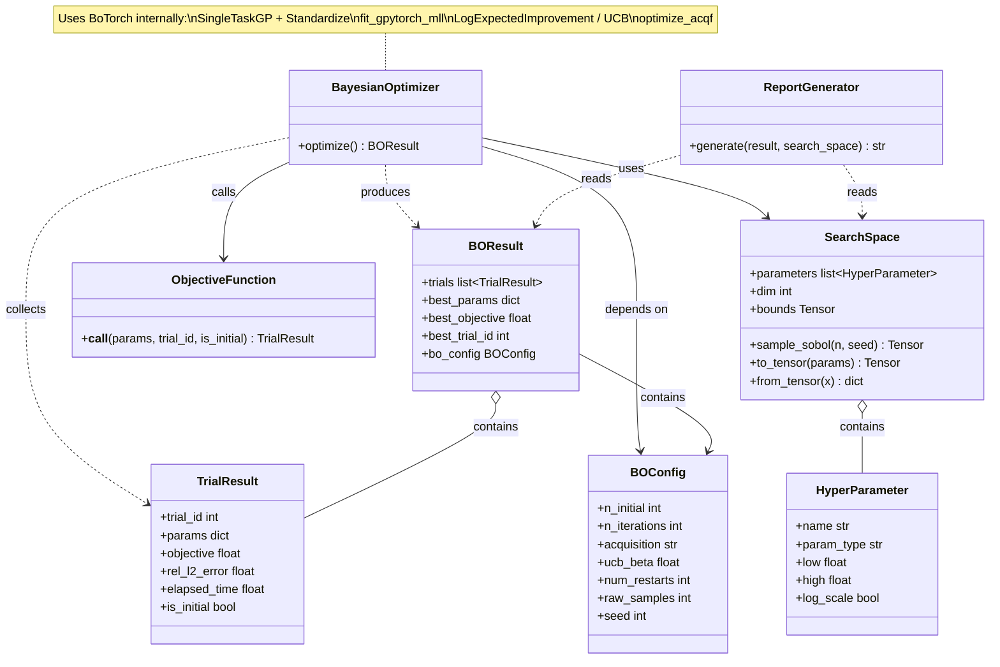

# 仕様書：BoTorch ベイズ最適化によるニューラルネットワークハイパーパラメータチューニング

## 1. 概要

**目的**：`BurgersPINNSolver.solve_forward()` のニューラルネットワーク部分のハイパーパラメータを、BoTorch（GPyTorch ベース）によるガウス過程ベイズ最適化で効率的に探索する。

**最適化対象**：`NetworkConfig` および `TrainingConfig` の一部パラメータ

**目的関数**：

$$\text{objective}(h) = \frac{1}{e_{\text{rel}}(h) \cdot T(h)}$$

- $e_{\text{rel}}$：テストデータに対する相対 L2 誤差（低いほど良い）
- $T$：学習にかかった経過時間 [秒]（低いほど良い）
- objective が **高いほど** 「精度が高く、かつ高速」であることを意味する

ベイズ最適化はこの `objective` を **最大化** する方向で探索する。

---

## 2. 探索空間（ハイパーパラメータ）

| パラメータ名 | 対応する設定クラス | 型 | 探索範囲 | スケール | 説明 |
|------------|-----------------|-----|---------|---------|------|
| `n_hidden_layers` | `NetworkConfig` | int | [2, 8] | linear | 隠れ層数 L |
| `n_neurons` | `NetworkConfig` | int | [10, 100] | linear | 各層のニューロン数 N |
| `lr` | `TrainingConfig` | float | [1e-4, 1e-2] | log | Adam 学習率 |
| `epochs_adam` | `TrainingConfig` | int | [500, 5000] | linear | Adam フェーズのエポック数 |

**固定パラメータ（チューニング対象外）**：

| パラメータ | 固定値 | 理由 |
|-----------|--------|------|
| `nu` | 0.01/π | 順問題の真値 |
| `n_u` | 100 | 論文の設定値 |
| `n_f` | 10,000 | 論文の設定値 |
| `epochs_lbfgs` | 50 | BO の実行時間制御のため固定 |
| 活性化関数 | tanh | 論文で固定 |

---

## 3. モジュール構成（`src/bo/`）

```
src/bo/
├── __init__.py      # パブリック API のエクスポート
├── space.py         # HyperParameter, SearchSpace
├── objective.py     # ObjectiveFunction
├── optimizer.py     # BayesianOptimizer（BoTorch を使用したメインループ）
├── report.py        # ReportGenerator（マークダウンレポートの生成）
└── result.py        # TrialResult, BOResult
```

BoTorch が GP サロゲートと獲得関数を提供するため、`surrogate.py` と `acquisition.py` は不要。

### パブリック API（`src/bo/__init__.py` からのエクスポート）

```python
from bo import (
    SearchSpace,
    HyperParameter,
    ObjectiveFunction,
    BayesianOptimizer,
    BOConfig,
    BOResult,
    TrialResult,
    ReportGenerator,
)
```

---

## 4. クラス設計

### 4-1. クラス一覧

| クラス名 | 種別 | 責務 |
|---------|------|------|
| `HyperParameter` | Pydantic モデル（frozen） | 1つのハイパーパラメータの定義（名前・型・範囲・スケール）を保持する |
| `SearchSpace` | Pydantic モデル（frozen） | ハイパーパラメータ群の定義と、BoTorch テンソルへの変換・逆変換を担う |
| `BOConfig` | Pydantic モデル（frozen） | ベイズ最適化の設定値（初期サンプル数・反復数・獲得関数種別・乱数シード等）を保持する |
| `TrialResult` | Pydantic モデル（frozen） | 1回の試行結果（ハイパーパラメータ値・目的関数値・精度・実行時間）を保持する |
| `BOResult` | Pydantic モデル（frozen） | 最適化全体の結果（全試行履歴・最良パラメータ）を保持する |
| `ObjectiveFunction` | 具象クラス | ハイパーパラメータを受け取り、PINNs を学習させて目的関数値を計算する |
| `BayesianOptimizer` | 具象クラス | BoTorch の `SingleTaskGP` + `optimize_acqf` を用いた BO メインループを実行する |
| `ReportGenerator` | 具象クラス | `BOResult` を受け取り、マークダウン形式のレポートファイルを生成する |

---

### 4-2. 各クラスの定義

#### `HyperParameter`

**種別**：Pydantic モデル（frozen）
**責務**：1つのハイパーパラメータの名前・型・探索範囲・スケールを保持する

```python
from pydantic import BaseModel, Field
from pydantic import ConfigDict
from typing import Literal

class HyperParameter(BaseModel):
    model_config = ConfigDict(frozen=True)

    name: str = Field(description="パラメータ名（NetworkConfig / TrainingConfig のフィールド名）")
    param_type: Literal["int", "float"] = Field(description="パラメータの型")
    low: float = Field(description="探索範囲の下限（実際のパラメータスケール）")
    high: float = Field(description="探索範囲の上限（実際のパラメータスケール）")
    log_scale: bool = Field(default=False, description="True の場合、対数スケールで探索する")
```

---

#### `SearchSpace`

**種別**：Pydantic モデル（frozen）
**責務**：ハイパーパラメータ群の定義と、BoTorch が要求する `[0, 1]^d` への正規化変換・逆変換を担う

```python
import torch
import numpy as np

class SearchSpace(BaseModel):
    model_config = ConfigDict(frozen=True)

    parameters: list[HyperParameter] = Field(description="チューニング対象のハイパーパラメータ一覧")

    @property
    def dim(self) -> int:
        """探索空間の次元数（パラメータ数）を返す。"""
        ...

    @property
    def bounds(self) -> torch.Tensor:
        """
        BoTorch の optimize_acqf に渡す正規化済み境界テンソル。
        shape: (2, dim), dtype: float64
        全次元で [0, 1] に収まる（正規化後）。
        """
        ...

    def sample_sobol(self, n: int, seed: int) -> torch.Tensor:
        """
        Sobol 列で n 点をサンプリングして返す（初期探索用）。
        BoTorch の draw_sobol_samples を使用。
        Returns: shape (n, dim), dtype: float64, 値域 [0, 1]^d
        """
        ...

    def to_tensor(self, params: dict[str, float | int]) -> torch.Tensor:
        """
        パラメータ dict を正規化済み BoTorch 入力テンソルに変換する。
        Returns: shape (1, dim), dtype: float64
        """
        ...

    def from_tensor(self, x: torch.Tensor) -> dict[str, float | int]:
        """
        正規化済みテンソル（shape: (dim,) または (1, dim)）をパラメータ dict に逆変換する。
        int 型は四捨五入する。
        """
        ...
```

**正規化規則**：

| スケール | 正規化（`to_tensor`） | 逆正規化（`from_tensor`） |
|---------|---------------------|------------------------|
| linear | $x' = (x - l) / (h - l)$ | $x = x' \cdot (h - l) + l$ |
| log | $x' = (\log x - \log l) / (\log h - \log l)$ | $x = \exp(x' \cdot (\log h - \log l) + \log l)$ |

正規化後はすべてのパラメータが $[0, 1]$ に収まり、BoTorch の `SingleTaskGP` の `input_transform=Normalize(d)` は不使用（手動正規化で統一）。

---

#### `BOConfig`

**種別**：Pydantic モデル（frozen）
**責務**：ベイズ最適化の設定値を保持する

```python
class BOConfig(BaseModel):
    model_config = ConfigDict(frozen=True)

    n_initial: int = Field(default=5, description="初期 Sobol サンプル数")
    n_iterations: int = Field(default=20, description="BO 反復回数（GP 更新サイクル数）")
    acquisition: Literal["EI", "UCB"] = Field(default="EI", description="獲得関数の種類")
    ucb_beta: float = Field(
        default=2.0,
        description="UCB の探索係数 β（acquisition='UCB' 時のみ有効）。BoTorch UCB の beta パラメータ。",
    )
    num_restarts: int = Field(
        default=10,
        description="optimize_acqf の多点再スタート数。大きいほど局所最適を回避しやすい。",
    )
    raw_samples: int = Field(
        default=512,
        description="optimize_acqf の初期候補サンプル数。",
    )
    seed: int = Field(default=42, description="乱数シード（再現性確保用）")
```

---

#### `TrialResult`

**種別**：Pydantic モデル（frozen）
**責務**：1回の試行（ハイパーパラメータ評価）の結果を保持する

```python
class TrialResult(BaseModel):
    model_config = ConfigDict(frozen=True)

    trial_id: int = Field(description="試行番号（0 始まり）")
    params: dict[str, float | int] = Field(description="評価したハイパーパラメータ値（実スケール）")
    objective: float = Field(description="目的関数値 = 1 / (rel_l2_error × elapsed_time)")
    rel_l2_error: float = Field(description="相対 L2 誤差 ‖u_pred - u_ref‖₂ / ‖u_ref‖₂")
    elapsed_time: float = Field(description="学習にかかった経過時間 [秒]")
    is_initial: bool = Field(description="True: Sobol 初期サンプル、False: BO 提案点")
```

---

#### `BOResult`

**種別**：Pydantic モデル（frozen）
**責務**：最適化全体の結果を保持する

```python
class BOResult(BaseModel):
    model_config = ConfigDict(frozen=True)

    trials: list[TrialResult] = Field(description="全試行結果（初期サンプル + BO 反復）")
    best_params: dict[str, float | int] = Field(description="目的関数が最大の試行のハイパーパラメータ")
    best_objective: float = Field(description="最大の目的関数値")
    best_trial_id: int = Field(description="最良試行の trial_id")
    bo_config: BOConfig = Field(description="使用した BO 設定（レポート記載用）")
```

---

#### `ObjectiveFunction`

**種別**：具象クラス
**責務**：ハイパーパラメータを受け取り、PINNs の学習と評価を実行し、目的関数値を返す

```python
class ObjectiveFunction:
    def __init__(
        self,
        pde_config: PDEConfig,
        boundary_data: BoundaryData,
        collocation: CollocationPoints,
        x_mesh: np.ndarray,
        t_mesh: np.ndarray,
        usol: np.ndarray,
        base_training_config: TrainingConfig,
    ) -> None:
        """
        Parameters
        ----------
        pde_config:
            固定の PDE 設定（ν 等）。
        boundary_data:
            学習に使う初期・境界条件データ。
        collocation:
            コロケーション点。
        x_mesh, t_mesh:
            評価用グリッド（meshgrid 形式）。
        usol:
            参照解 shape (256, 100)。相対 L2 誤差の計算に使用。
        base_training_config:
            n_u, n_f, epochs_lbfgs など固定の学習設定。
            n_hidden_layers / n_neurons / lr / epochs_adam はハイパーパラメータで上書きされる。
        """
        ...

    def __call__(self, params: dict[str, float | int], trial_id: int, is_initial: bool) -> TrialResult:
        """
        ハイパーパラメータを受け取り、1回の学習・評価を行い TrialResult を返す。

        処理フロー
        ----------
        1. params から NetworkConfig / TrainingConfig を構築する
        2. BurgersPINNSolver.solve_forward() を time.perf_counter() で計時しながら実行する
        3. 学習済みモデルで評価グリッド上の u_pred を計算する（torch.no_grad()）
        4. rel_l2_error = ‖u_pred - usol‖_F / ‖usol‖_F を計算する
        5. objective = 1 / max(rel_l2_error × T, 1e-10) を計算する
        6. TrialResult を構築して返す
        """
        ...
```

---

#### `BayesianOptimizer`

**種別**：具象クラス
**責務**：BoTorch の `SingleTaskGP` と `optimize_acqf` を用いた BO メインループを実行する

**使用する BoTorch コンポーネント**：

| コンポーネント | 用途 |
|--------------|------|
| `botorch.models.SingleTaskGP` | GP サロゲートモデル（Matérn 5/2 カーネルがデフォルト） |
| `botorch.models.transforms.outcome.Standardize` | 目的関数値の標準化（数値安定性のため） |
| `gpytorch.mlls.ExactMarginalLogLikelihood` | GP のカーネルパラメータ最適化用の周辺対数尤度 |
| `botorch.fit.fit_gpytorch_mll` | 周辺対数尤度の最大化による GP フィッティング |
| `botorch.acquisition.analytic.LogExpectedImprovement` | EI 獲得関数（対数版。数値安定性が高い） |
| `botorch.acquisition.analytic.UpperConfidenceBound` | UCB 獲得関数 |
| `botorch.optim.optimize_acqf` | 獲得関数を勾配法で最大化して次点を決定する |
| `botorch.utils.sampling.draw_sobol_samples` | 初期 Sobol サンプリング |

```python
import torch
from botorch.models import SingleTaskGP
from botorch.models.transforms.outcome import Standardize
from botorch.fit import fit_gpytorch_mll
from botorch.acquisition.analytic import LogExpectedImprovement, UpperConfidenceBound
from botorch.optim import optimize_acqf
from gpytorch.mlls import ExactMarginalLogLikelihood

class BayesianOptimizer:
    def __init__(
        self,
        search_space: SearchSpace,
        objective: ObjectiveFunction,
        config: BOConfig,
    ) -> None: ...

    def optimize(self) -> BOResult:
        """
        ベイズ最適化を実行して BOResult を返す。

        処理フロー
        ----------
        Phase 1 — 初期 Sobol サンプリング（config.n_initial 点）
          1. SearchSpace.sample_sobol() で n_initial 点を生成する（shape: (n_initial, dim)）
          2. 各点を SearchSpace.from_tensor() でパラメータ dict に変換する
          3. ObjectiveFunction を評価して TrialResult を記録する
          4. 観測データ train_X (n_initial, dim), train_Y (n_initial, 1) を torch.float64 で構築する

        Phase 2 — GP ベースの逐次探索（config.n_iterations 回）
          5. SingleTaskGP(train_X, train_Y, outcome_transform=Standardize(m=1)) で GP を構築する
          6. fit_gpytorch_mll() で GP をフィッティングする
          7. config.acquisition に応じて LogExpectedImprovement または UpperConfidenceBound を構築する
          8. optimize_acqf() で次点 x_next (1, dim) を取得する
               - bounds: SearchSpace.bounds（shape: (2, dim)）
               - num_restarts: config.num_restarts
               - raw_samples: config.raw_samples
          9. SearchSpace.from_tensor(x_next) でパラメータ dict に変換する
          10. ObjectiveFunction を評価して TrialResult を記録する
          11. train_X, train_Y に新点を追加する
          12. 5〜11 を n_iterations 回繰り返す

        Phase 3 — 結果の集計
          13. 全試行から最良の TrialResult を特定する
          14. BOResult を構築して返す
        """
        ...
```

---

#### `ReportGenerator`

**種別**：具象クラス
**責務**：`BOResult` を受け取り、マークダウン形式のレポートファイルを生成する

```python
class ReportGenerator:
    def __init__(self, output_dir: str) -> None:
        """
        Parameters
        ----------
        output_dir:
            レポートの出力先ディレクトリ（例: "example/output"）。
        """
        ...

    def generate(self, result: BOResult, search_space: SearchSpace) -> str:
        """
        BOResult からマークダウンレポートを生成してファイルに保存する。

        Parameters
        ----------
        result:
            BayesianOptimizer.optimize() の戻り値。
        search_space:
            探索空間の定義（レポートのヘッダーに記載）。

        Returns
        -------
        str
            保存したファイルのパス。
        """
        ...
```

**出力ファイル名**：`bo_report.md`（`output_dir` 以下）

**レポートの構成**：

```markdown
# Bayesian Optimization Report
## Burgers PINNs Hyperparameter Tuning

Generated: {実行日時 ISO 8601}

---

## 1. Configuration

| Parameter         | Value  |
|-------------------|--------|
| n_initial         | {値}   |
| n_iterations      | {値}   |
| acquisition       | {EI/UCB} |
| seed              | {値}   |
| num_restarts      | {値}   |
| raw_samples       | {値}   |

### Search Space

| Hyperparameter    | Type  | Low    | High   | Scale  |
|-------------------|-------|--------|--------|--------|
| n_hidden_layers   | int   | 2      | 8      | linear |
| n_neurons         | int   | 10     | 100    | linear |
| lr                | float | 1e-4   | 1e-2   | log    |
| epochs_adam       | int   | 500    | 5000   | linear |

---

## 2. Best Result

**Trial ID**: {best_trial_id}
**Objective**: {best_objective:.4e}

| Hyperparameter    | Value  |
|-------------------|--------|
| n_hidden_layers   | {値}   |
| n_neurons         | {値}   |
| lr                | {値:.4e} |
| epochs_adam       | {値}   |

**Metrics**:
- Relative L2 Error: {rel_l2_error:.4e}
- Elapsed Time: {elapsed_time:.2f} s

---

## 3. All Trials

| Trial | Type    | n_layers | n_neurons | lr       | epochs_adam | Rel L2 Error | Time (s) | Objective  |
|-------|---------|----------|-----------|----------|-------------|--------------|----------|------------|
| 0     | initial | {値}     | {値}      | {値:.2e} | {値}        | {値:.4e}     | {値:.2f} | {値:.4e}   |
| ...   | ...     | ...      | ...       | ...      | ...         | ...          | ...      | ...        |
| {N}   | BO      | {値}     | {値}      | {値:.2e} | {値}        | {値:.4e}     | {値:.2f} | {値:.4e}   |

> **Type**: `initial` = Sobol initial sample, `BO` = Bayesian optimization proposal

---

## 4. Convergence

Best objective per trial (cumulative max):

| Trial | Best Objective So Far |
|-------|-----------------------|
| 0     | {値:.4e}              |
| ...   | ...                   |
```

---

## 5. クラス図（Mermaid）



---

## 6. `example/bo_forward.py` の仕様

`example/forward_problem.py` と同じデータパイプラインを共用し、BO による探索を実行するサンプルスクリプト。

### 実行方法

```bash
cd 03-PINNs-Burgers
uv run python example/bo_forward.py
```

### 出力ファイル（`example/output/` 以下）

| ファイル名 | 内容 |
|-----------|------|
| `bo_convergence.png` | 試行番号 vs 最良目的関数値の推移（BO の収束曲線） |
| `bo_objective_scatter.png` | 全試行の目的関数値の散布図（初期サンプルと BO 提案点で色分け） |
| `bo_parallel_coords.png` | 平行座標プロット（ハイパーパラメータ値 vs 目的関数値） |
| `bo_best_solution_heatmap.png` | 最良パラメータで学習した PINN の予測解 vs 参照解のヒートマップ |
| `bo_report.md` | 探索結果のマークダウンレポート |

### フロー

```python
# 1. データ読み込み（forward_problem.py と共通）
x_grid, t_grid, X_mesh, T_mesh, usol = load_reference_data()
boundary_data = sample_boundary_data(x_grid, t_grid, usol, n_u=100)
collocation = sample_collocation_points(x_grid, t_grid, n_f=10_000)

# 2. 固定設定
pde_config = PDEConfig(nu=NU_TRUE, x_min=-1.0, x_max=1.0, t_min=0.0, t_max=1.0)
base_training_config = TrainingConfig(n_u=100, n_f=10_000, lr=1e-3,
                                       epochs_adam=2_000, epochs_lbfgs=50)

# 3. 探索空間の定義
search_space = SearchSpace(parameters=[
    HyperParameter(name="n_hidden_layers", param_type="int",   low=2,    high=8),
    HyperParameter(name="n_neurons",       param_type="int",   low=10,   high=100),
    HyperParameter(name="lr",              param_type="float", low=1e-4, high=1e-2, log_scale=True),
    HyperParameter(name="epochs_adam",     param_type="int",   low=500,  high=5_000),
])

# 4. 目的関数
objective = ObjectiveFunction(
    pde_config=pde_config,
    boundary_data=boundary_data,
    collocation=collocation,
    x_mesh=X_mesh, t_mesh=T_mesh, usol=usol,
    base_training_config=base_training_config,
)

# 5. BO 実行
bo_config = BOConfig(n_initial=5, n_iterations=20, acquisition="EI", seed=42)
optimizer = BayesianOptimizer(search_space, objective, bo_config)
result = optimizer.optimize()

# 6. マークダウンレポートの生成
reporter = ReportGenerator(output_dir=OUTPUT_DIR)
report_path = reporter.generate(result, search_space)
print(f"Report saved: {report_path}")

# 7. 可視化
plot_convergence(result)
plot_objective_scatter(result)
plot_parallel_coords(result)
plot_best_solution_heatmap(result, objective)
```

---

## 7. 依存ライブラリ

| ライブラリ | 用途 |
|-----------|------|
| `botorch` | `SingleTaskGP`, `LogExpectedImprovement`, `UpperConfidenceBound`, `optimize_acqf`, `draw_sobol_samples` |
| `gpytorch` | `ExactMarginalLogLikelihood`（GP のカーネルパラメータ最適化） |
| `torch` | テンソル演算（float64 必須）、GP の入出力形式 |
| `numpy` | 可視化・評価時の配列操作 |
| `PINNs_Burgers` | `BurgersPINNSolver`, `NetworkConfig`, `TrainingConfig` 等 |
| `pydantic` | データクラスの型バリデーション |
| `seaborn`, `matplotlib` | 可視化 |

---

## 8. 実装上の注意点

| 項目 | 内容 |
|------|------|
| テンソルの dtype | BoTorch は `float64` を要求する。`train_X`, `train_Y`, `bounds` はすべて `torch.float64` で構築する。 |
| 目的関数の数値安定性 | `rel_l2_error × T` が極めて小さい場合の発散を防ぐため、`max(..., 1e-10)` でクランプする。 |
| `Standardize` の適用 | `SingleTaskGP(outcome_transform=Standardize(m=1))` で目的関数値を自動標準化し、GP の数値安定性を確保する。 |
| `LogExpectedImprovement` の `best_f` | `train_Y` の最大値を `best_f` として渡す。`Standardize` 適用後の GP の予測はスケール変換済みのため、`train_Y.max()` を使う。 |
| `epochs_lbfgs` の扱い | BO 中の学習時間短縮のため `epochs_lbfgs=50` に固定する。最良パラメータを用いた最終評価では元の設定（`epochs_lbfgs=50`）を維持する。 |
| Sobol 列の再現性 | `draw_sobol_samples` に `seed=config.seed` を渡して Sobol 列の再現性を確保する。 |
| `optimize_acqf` の `q=1` | 逐次的に 1 点ずつ提案する（バッチ獲得ではない）。 |
