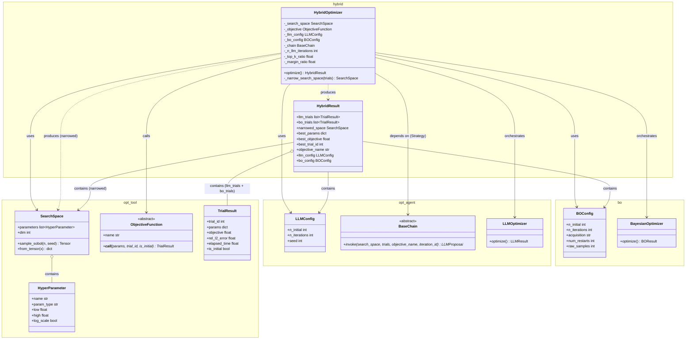

# 実装設計書：Hybrid LLM + BO Hyperparameter Optimizer

## 1. 設計の概要

**手法名**：Hybrid LLM + Bayesian Optimization（2 フェーズハイパーパラメータ最適化）
**参照ファイル**：本ドキュメントが設計の起点（`src/bo/` および `src/opt_agent/` の組み合わせによる新規モジュール）

**設計の方針**
LLM による広域探索とベイズ最適化（BO）による局所収束を 2 フェーズで順番に実行するパイプラインを実装する。
`HybridOptimizer` は `LLMOptimizer` と `BayesianOptimizer` をオーケストレートする Facade クラスとして設計し、`BaseOptimizer` は継承しない（試行結果が `llm_trials` / `bo_trials` の 2 リストに分離されており、Template Method の 3 フェーズ構造に収まらないため）。
探索空間絞り込みのロジックはプライベートメソッド `_narrow_search_space` に集約し、単一責任の原則を守る。
設定値と最適化結果はすべてイミュータブルなデータクラスで管理する。

---

## 2. パブリック API

```python
class HybridOptimizer:
    """
    LLM による探索空間絞り込みと BO による最適解探索を組み合わせた
    2 フェーズハイパーパラメータ最適化パイプライン。

    Phase 1: LLMOptimizer で n_llm_iterations 回探索し、
             上位 top_k_ratio 割の試行から探索空間を絞り込む。
    Phase 2: 絞り込まれた SearchSpace で BayesianOptimizer を実行する。
    """

    def __init__(
        self,
        search_space: SearchSpace,
        objective: ObjectiveFunction,
        llm_config: LLMConfig,
        bo_config: BOConfig,
        chain: BaseChain | None = None,
        n_llm_iterations: int = 10,
        top_k_ratio: float = 0.3,
        margin_ratio: float = 0.1,
    ) -> None:
        """
        オプティマイザを初期化する。
        chain が None の場合は .env から GEMINI_API_KEY / GEMINI_MODEL_NAME を
        読み込み、GeminiChain を構築する（LLMOptimizer に委譲）。
        """
        ...

    def optimize(self) -> HybridResult:
        """
        2 フェーズ最適化パイプラインを実行し HybridResult を返す。
        Phase 1 → 探索空間絞り込み → Phase 2 の順に実行する。
        """
        ...
```

---

## 3. クラス設計

### 3-1. クラス一覧

| クラス名 | 配置モジュール | 種別 | 責務（単一責任の原則） | 対応するアルゴリズムの概念 |
|---------|--------------|------|---------------------|-----------------------------|
| `HybridResult` | `hybrid.result` | frozen dataclass | ハイブリッド最適化の全結果フィールドを保持する | Phase 1/2 の統合出力 |
| `HybridOptimizer` | `hybrid.optimizer` | 具象クラス | 2 フェーズ最適化パイプラインのオーケストレーション | Phase 1/探索空間絞り込み/Phase 2 の制御フロー |

---

### 3-2. 各クラスの定義

#### `HybridResult`（`hybrid/result.py`）

**種別**：frozen dataclass
**責務**：ハイブリッド最適化全体の結果を保持する。LLM 試行と BO 試行を分離して保持する点が `BOResult` / `LLMResult` と異なる
**対応するアルゴリズムの概念**：2 フェーズ最適化の統合出力

```python
from dataclasses import dataclass
from opt_tool.result import TrialResult
from opt_tool.space import SearchSpace
from bo.result import BOConfig
from opt_agent.config import LLMConfig


@dataclass(frozen=True)
class HybridResult:
    llm_trials: list[TrialResult]         # Phase 1 の全試行（Sobol 初期 + LLM 主導）
    bo_trials: list[TrialResult]          # Phase 2 の全試行（Sobol 初期 + BO 主導）
    narrowed_space: SearchSpace           # Phase 1 の結果から絞り込まれた探索空間
    best_params: dict[str, float | int]   # 最良試行のハイパーパラメータ値
    best_objective: float                 # 全試行（Phase 1 + 2）中の最大目的関数値
    best_trial_id: int                    # llm_trials + bo_trials 結合リスト内のインデックス
    objective_name: str                   # 使用した目的関数の名称
    llm_config: LLMConfig                 # Phase 1 で使用した LLM 設定
    bo_config: BOConfig                   # Phase 2 で使用した BO 設定
```

**`BaseOptimizationResult` を継承しない理由**：
`BaseOptimizationResult.trials` は単一の試行リストを想定しているが、`HybridResult` は Phase 1 と Phase 2 の試行を分離して保持する必要があり、構造的に不一致になるため。

**SOLIDチェック**
- S: 結果の保持のみを責務とする。集計・可視化・レポート生成は別クラスが担う
- O: フィールド追加で拡張可能（既存コードの変更不要）

---

#### `HybridOptimizer`（`hybrid/optimizer.py`）

**種別**：具象クラス（`BaseOptimizer` を継承しない）
**責務**：`LLMOptimizer` と `BayesianOptimizer` のオーケストレーションおよび探索空間の絞り込み
**対応するアルゴリズムの概念**：Phase 1/探索空間絞り込み/Phase 2 の制御フロー

```python
import dataclasses
import math

from bo.optimizer import BayesianOptimizer
from bo.result import BOConfig
from hybrid.result import HybridResult
from opt_agent.chain import BaseChain
from opt_agent.config import LLMConfig
from opt_agent.optimizer import LLMOptimizer
from opt_tool.objective import ObjectiveFunction
from opt_tool.result import TrialResult
from opt_tool.space import HyperParameter, SearchSpace


class HybridOptimizer:

    def __init__(
        self,
        search_space: SearchSpace,
        objective: ObjectiveFunction,
        llm_config: LLMConfig,
        bo_config: BOConfig,
        chain: BaseChain | None = None,
        n_llm_iterations: int = 10,
        top_k_ratio: float = 0.3,
        margin_ratio: float = 0.1,
    ) -> None: ...

    def optimize(self) -> HybridResult:
        """Phase 1 → 探索空間絞り込み → Phase 2 を順に実行して HybridResult を返す。"""
        ...

    def _narrow_search_space(self, trials: list[TrialResult]) -> SearchSpace:
        """Phase 1 の試行上位から新しい SearchSpace を構築する。"""
        ...
```

**`optimize()` の処理フロー**：

```
Phase 1: LLM 探索
  1. n_iterations=n_llm_iterations で LLMConfig を上書き
     （dataclasses.replace(llm_config, n_iterations=n_llm_iterations)）
  2. LLMOptimizer(search_space, objective, modified_llm_config, chain) を構築
  3. llm_result = llm_optimizer.optimize()
  4. llm_trials = llm_result.trials（Sobol + LLM 主導の全試行）

探索空間絞り込み:
  5. narrowed_space = _narrow_search_space(llm_trials)
  6. 絞り込み結果を標準出力に表示

Phase 2: BO 探索
  7. BayesianOptimizer(narrowed_space, objective, bo_config) を構築
  8. bo_result = bo_optimizer.optimize()
  9. bo_trials = bo_result.trials（Sobol + BO 主導の全試行）

結果集約:
  10. combined = llm_trials + bo_trials
  11. best_idx = argmax index in combined by objective
  12. HybridResult を構築して返す
```

**`_narrow_search_space()` の処理フロー**：

```
1. n_top = max(1, ceil(len(trials) * top_k_ratio))
2. top_trials = trials をobjective 降順でソートした上位 n_top 件

各 HyperParameter hp について:
  values = [t.params[hp.name] for t in top_trials]

  if hp.log_scale:
    log_range = log(hp.high) - log(hp.low)
    new_log_low  = min(log(v) for v in values) - margin_ratio * log_range
    new_log_high = max(log(v) for v in values) + margin_ratio * log_range
    new_low  = exp(max(new_log_low,  log(hp.low)))
    new_high = exp(min(new_log_high, log(hp.high)))
  else:
    linear_range = hp.high - hp.low
    new_low  = max(hp.low,  min(values) - margin_ratio * linear_range)
    new_high = min(hp.high, max(values) + margin_ratio * linear_range)

  フォールバック: new_low >= new_high の場合 → 元の [hp.low, hp.high] を使用

3. SearchSpace(parameters=[新しい HyperParameter ...]) を返す
```

**SOLIDチェック**
- S: 2 フェーズパイプラインの制御と探索空間絞り込みのみを責務とする
- O: フェーズの追加は新メソッドの追加で対応（既存メソッドの変更不要）
- D: `LLMOptimizer`・`BayesianOptimizer` を内部で使用するが、`BaseChain`（抽象）経由で LLM 実装に依存しない

---

## 4. デザインパターン

| パターン名 | 適用箇所（クラス名） | 採用理由 |
|-----------|-------------------|---------|
| Facade | `HybridOptimizer` | `LLMOptimizer`・`BayesianOptimizer`・探索空間絞り込みを単一の `optimize()` API に集約し、利用側の複雑性を隠蔽するため |
| Strategy | `BaseChain`（`LLMOptimizer` 経由） | LLM 実装（Gemini/Mock）を差し替えられる構造を `LLMOptimizer` から引き継ぐため |
| Value Object（データクラス） | `HybridResult` | 最適化結果は不変であるべきで、データの保持が責務であることを明示するため |

### Facade パターンの詳細

**適用箇所**：`HybridOptimizer`
**採用理由**：`LLMOptimizer`・`BayesianOptimizer`・探索空間絞り込みという 3 つの処理を利用者が直接組み立てる必要がなく、`HybridOptimizer(…).optimize()` の 1 呼び出しで完結させる。`bo_forward.py` / `opt_agent_forward.py` と同様のシンプルな使用感を維持する。
**代替案と却下理由**：`BaseOptimizer` を継承して Template Method で実装する案は、`trials` が 2 つのリストに分離されており `BaseOptimizationResult` の構造と合わないため却下した。

---

## 5. クラス図（Mermaid）



---

## 6. モジュール構成

```
src/hybrid/
├── __init__.py     # パブリック API のエクスポート（HybridOptimizer, HybridResult）
├── result.py       # HybridResult dataclass
└── optimizer.py    # HybridOptimizer（Facade）
```

### パブリック API（`src/hybrid/__init__.py` からのエクスポート）

```python
from hybrid.optimizer import HybridOptimizer
from hybrid.result import HybridResult

__all__ = [
    "HybridOptimizer",
    "HybridResult",
]
```

---

## 7. `example/hybrid_forward.py` の仕様

`bo_forward.py` / `opt_agent_forward.py` と同じデータパイプライン・探索空間・目的関数を使用し、ハイブリッド最適化の結果を `example/hybrid_output/` に出力するサンプルスクリプト。

### 実行方法

```bash
cd 03-PINNs-Burgers
uv run python example/hybrid_forward.py
```

### 出力ファイル（`example/hybrid_output/` 以下）

| ファイル名 | 内容 |
|-----------|------|
| `hybrid_convergence.png` | 全試行（Phase 1 + Phase 2）の累積最良目的関数値の推移 |
| `hybrid_objective_scatter.png` | 全試行の目的関数値散布図（LLM 試行・BO 試行・Sobol 初期を色分け） |
| `hybrid_space_comparison.png` | 元の探索空間と絞り込まれた探索空間の比較（パラメータ別バーチャート） |
| `hybrid_best_solution_heatmap.png` | 最良パラメータで学習した PINN の予測解 vs 参照解のヒートマップ |

### フロー

```python
# 1. データ読み込み（bo_forward.py / opt_agent_forward.py と共通）
x_grid, t_grid, X_mesh, T_mesh, usol = load_reference_data()
boundary_data = sample_boundary_data(x_grid, t_grid, usol, n_u=100)
collocation = sample_collocation_points(x_grid, t_grid, n_f=10_000)

# 2. 固定設定（bo_forward.py と同一）
pde_config = PDEConfig(nu=NU_TRUE, x_min=-1.0, x_max=1.0, t_min=0.0, t_max=1.0)
base_training_config = TrainingConfig(n_u=100, n_f=10_000, lr=1e-3,
                                       epochs_adam=2_000, epochs_lbfgs=50)

# 3. 探索空間の定義（bo_forward.py と同一）
search_space = SearchSpace(parameters=[
    HyperParameter(name="n_hidden_layers", param_type="int",   low=2,    high=8),
    HyperParameter(name="n_neurons",       param_type="int",   low=10,   high=100),
    HyperParameter(name="lr",              param_type="float", low=1e-4, high=1e-2, log_scale=True),
    HyperParameter(name="epochs_adam",     param_type="int",   low=500,  high=5_000),
])

# 4. 目的関数（bo_forward.py と同一）
objective = AccuracyObjective(...)

# 5. ハイブリッド最適化の実行
llm_config = LLMConfig(n_initial=5, n_iterations=10, seed=42)
bo_config = BOConfig(n_initial=5, n_iterations=15, acquisition="EI", seed=42)
optimizer = HybridOptimizer(
    search_space, objective,
    llm_config=llm_config,
    bo_config=bo_config,
    n_llm_iterations=10,
    top_k_ratio=0.3,
    margin_ratio=0.1,
)
result = optimizer.optimize()

# 6. 可視化
plot_convergence(result)
plot_objective_scatter(result)
plot_space_comparison(result, search_space)
plot_best_solution_heatmap(result, ...)
```

---

## 8. 依存ライブラリ

| ライブラリ | 用途 | 対応する処理 |
|-----------|------|------------|
| `opt_agent` | `LLMOptimizer`, `LLMConfig`, `BaseChain` | Phase 1 LLM 探索 |
| `bo` | `BayesianOptimizer`, `BOConfig` | Phase 2 BO 探索 |
| `opt_tool` | `SearchSpace`, `HyperParameter`, `TrialResult` | 探索空間定義・試行結果保持・絞り込み |
| `math` | `log`, `exp`, `ceil` | 探索空間絞り込み（log スケール処理） |
| `dataclasses` | `replace` | `LLMConfig.n_iterations` の上書き（frozen dataclass の非破壊コピー） |

---

## 9. 実装上の注意点

| 項目 | 内容 | 対応するメソッド |
|------|------|----------------|
| `LLMConfig.n_iterations` の上書き | `llm_config` は `frozen=True` のため `dataclasses.replace(llm_config, n_iterations=n_llm_iterations)` で新インスタンスを生成する。元の `llm_config`（ユーザーが指定した値）は `HybridResult.llm_config` に保存する | `HybridOptimizer.optimize` |
| `best_trial_id` の定義 | `llm_trials + bo_trials` 結合リスト内のインデックスを使用する。各フェーズの `TrialResult.trial_id` はフェーズ内でリセットされるため、グローバルな一意識別子として使用しない | `HybridOptimizer.optimize` |
| 探索空間絞り込みの log スケール処理 | log スケールパラメータは log 空間でマージン計算を行い、exp で実スケールに戻す。線形スケールとは別のコードパスを通す | `HybridOptimizer._narrow_search_space` |
| `new_low >= new_high` のフォールバック | top-k 試行がすべて同一値を持つ場合など、絞り込み後に `new_low >= new_high` になりうる。この場合は元の境界 `[hp.low, hp.high]` を使用する | `HybridOptimizer._narrow_search_space` |
| Phase 2 の `BayesianOptimizer` は絞り込み空間で Sobol 初期探索を行う | `BOConfig.n_initial` に従って絞り込まれた `narrowed_space` で Sobol サンプリングを実行する。Phase 1 の Sobol 試行とは別の試行が生成される | `BayesianOptimizer._run_initial_exploration` |
| `chain=None` 時の環境変数依存 | `chain=None` の場合、`LLMOptimizer.__init__` が `GEMINI_API_KEY` を読み込む。未設定時は `ValueError` が送出される | `LLMOptimizer.__init__` |
| `pyproject.toml` へのパッケージ追加 | `[tool.hatch.build.targets.wheel]` の `packages` に `"src/hybrid"` を追記する | `pyproject.toml` |
