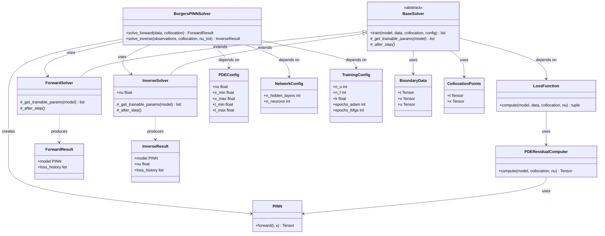

# 実装設計書：Physics-Informed Neural Networks（PINNs）— Burgers 方程式

## 1. 設計の概要

**手法名**：Physics-Informed Neural Networks（PINNs）
**参照ファイル**：`/doc/paper_method.md`

**設計の方針**
Algorithm 1（PDE 残差計算）を独立したクラスとして分離し，Algorithm 2（順問題）と Algorithm 3（逆問題）の両ソルバーが共通利用する構造とする．
順問題と逆問題はトレーニングループの骨格が同一で Step 1（$\nu$ の扱い）と Step 9（更新対象）のみが異なるため，Template Method パターンを適用して差分を最小化する．
ハイパーパラメータ・問題設定はすべてイミュータブルなデータクラスで管理し，設定の変更が意図せずソルバーに副作用を与えないようにする．

---

## 2. パブリックAPI（Algorithm 表に基づく）

```python
class BurgersPINNSolver:
    """
    PINNs による Burgers 方程式ソルバーのメインインターフェース。
    Algorithm 2（順問題）と Algorithm 3（逆問題）をパブリック API として公開する。
    """

    def solve_forward(
        self,
        data: BoundaryData,
        collocation: CollocationPoints,
    ) -> ForwardResult:
        """
        Algorithm 2: PINN 順問題ソルバー
        対応数式: 式(7)(8)(9)(10)
        学習済みネットワークパラメータ θ* を返す。
        """
        ...

    def solve_inverse(
        self,
        observations: BoundaryData,
        collocation: CollocationPoints,
        nu_init: float,
    ) -> InverseResult:
        """
        Algorithm 3: PINN 逆問題ソルバー（動粘性係数の同定）
        対応数式: 式(11)
        θ* と推定された ν* を返す。
        """
        ...
```

---

## 3. クラス設計

### 3-1. クラス一覧

| クラス名 | 種別 | 責務（単一責任の原則） | 対応する論文の概念 |
|---------|------|---------------------|-----------------|
| `PDEConfig` | データクラス（frozen） | 問題設定値（ν, ドメイン, 初期条件）の保持 | Section 2（支配方程式・境界条件） |
| `NetworkConfig` | データクラス（frozen） | ネットワーク構造設定（層数, 幅, 活性化関数）の保持 | 式(5)，Section 6.1 |
| `TrainingConfig` | データクラス（frozen） | 学習設定（N_u, N_f, lr, エポック数）の保持 | Algorithm 2/3 Step 2，Section 6.1 |
| `BoundaryData` | データクラス | 初期・境界条件データ点 $(t_u^i, x_u^i, u^i)$ の保持 | 式(8) |
| `CollocationPoints` | データクラス | コロケーション点 $(t_f^j, x_f^j)$ の保持 | 式(9) |
| `ForwardResult` | データクラス（frozen） | 順問題の結果（θ*, 損失履歴）の保持 | Algorithm 2 出力 |
| `InverseResult` | データクラス（frozen） | 逆問題の結果（θ*, ν*, 損失履歴）の保持 | Algorithm 3 出力 |
| `PINN` | 具象クラス（nn.Module） | ネットワーク $u_\theta(t,x)$ の順伝播・Xavier 初期化 | 式(5)，Algorithm 2 Step 1 |
| `PDEResidualComputer` | 具象クラス | Algorithm 1：自動微分による PDE 残差 $f$ の計算 | 式(6)，Algorithm 1 |
| `LossFunction` | 具象クラス | $L = L_{\text{data}} + L_{\text{phys}}$ の計算 | 式(7)(8)(9) |
| `BaseSolver` | 抽象クラス | トレーニングループの骨格（Template Method） | Algorithm 2/3 共通部分 |
| `ForwardSolver` | 具象クラス | Algorithm 2：Adam + L-BFGS 二段階最適化 | Algorithm 2 |
| `InverseSolver` | 具象クラス | Algorithm 3：θ と ν の同時最適化 | Algorithm 3 |
| `BurgersPINNSolver` | 具象クラス | パブリック API の提供・依存クラスの組み立て | — |

---

### 3-2. 各クラスの定義

#### `PDEConfig`

**種別**：データクラス（frozen）
**責務**：Burgers 方程式の問題設定値を保持する
**対応する論文の概念**：式(1)(2)(3)(4)，Section 2

```python
@dataclass(frozen=True)
class PDEConfig:
    nu: float          # ν：動粘性係数（デフォルト 0.01/π）
    x_min: float       # x ドメイン下限（-1.0）
    x_max: float       # x ドメイン上限（1.0）
    t_min: float       # t ドメイン下限（0.0）
    t_max: float       # t ドメイン上限（1.0）
```

**SOLIDチェック**
- S: 問題設定値の保持のみを責務とする
- O: 新たな PDE パラメータはフィールド追加で対応（既存コードの変更不要）
- D: 具体値を保持するため抽象への依存は不要

---

#### `NetworkConfig`

**種別**：データクラス（frozen）
**責務**：ネットワーク構造に関するハイパーパラメータを保持する
**対応する論文の概念**：式(5)，Section 6.1

```python
@dataclass(frozen=True)
class NetworkConfig:
    n_hidden_layers: int   # L：隠れ層数（デフォルト 4）
    n_neurons: int         # N：各層のニューロン数（デフォルト 20）
```

**備考**：活性化関数は論文で tanh に固定されているため設定項目に含めない

**SOLIDチェック**
- S: ネットワーク構造設定値の保持のみを責務とする
- O: フィールド追加で拡張可能
- D: 抽象への依存不要

---

#### `TrainingConfig`

**種別**：データクラス（frozen）
**責務**：学習に関するハイパーパラメータを保持する
**対応する論文の概念**：Algorithm 2 Step 2，Section 6.1

```python
@dataclass(frozen=True)
class TrainingConfig:
    n_u: int              # N_u：初期・境界条件データ点数（デフォルト 100）
    n_f: int              # N_f：コロケーション点数（デフォルト 10000）
    lr: float             # η：学習率
    epochs_adam: int      # E_Adam：Adam フェーズのエポック数
    epochs_lbfgs: int     # E_LBFGS：L-BFGS フェーズのエポック数（逆問題では不使用）
```

**SOLIDチェック**
- S: 学習設定値の保持のみを責務とする
- O: フィールド追加で拡張可能
- D: 抽象への依存不要

---

#### `BoundaryData`

**種別**：データクラス
**責務**：初期・境界条件データ点 $\{(t_u^i, x_u^i, u^i)\}$ を保持する
**対応する論文の概念**：式(8)

```python
@dataclass
class BoundaryData:
    t: torch.Tensor   # 形状 (N_u, 1)
    x: torch.Tensor   # 形状 (N_u, 1)
    u: torch.Tensor   # 形状 (N_u, 1)
```

**SOLIDチェック**
- S: 境界・初期条件データの保持のみを責務とする
- D: 抽象への依存不要

---

#### `CollocationPoints`

**種別**：データクラス
**責務**：コロケーション点 $\{(t_f^j, x_f^j)\}$ を保持する
**対応する論文の概念**：式(9)

```python
@dataclass
class CollocationPoints:
    t: torch.Tensor   # 形状 (N_f, 1)
    x: torch.Tensor   # 形状 (N_f, 1)
```

**SOLIDチェック**
- S: コロケーション点座標の保持のみを責務とする
- D: 抽象への依存不要

---

#### `ForwardResult`

**種別**：データクラス（frozen）
**責務**：順問題の最適化結果を保持する
**対応する論文の概念**：Algorithm 2 出力

```python
@dataclass(frozen=True)
class ForwardResult:
    model: PINN                   # 学習済みネットワーク θ*
    loss_history: list[float]     # 損失値の履歴
```

---

#### `InverseResult`

**種別**：データクラス（frozen）
**責務**：逆問題の最適化結果（θ* と ν*）を保持する
**対応する論文の概念**：Algorithm 3 出力，式(11)

```python
@dataclass(frozen=True)
class InverseResult:
    model: PINN                   # 学習済みネットワーク θ*
    nu: float                     # 推定された動粘性係数 ν*
    loss_history: list[float]     # 損失値の履歴
```

---

#### `PINN`

**種別**：具象クラス（`nn.Module`）
**責務**：式(5) のフィードフォワードネットワーク $u_\theta(t,x)$ の順伝播と Xavier 初期化
**対応する論文の概念**：式(5)，Algorithm 2 Step 1

```python
class PINN(nn.Module):
    def __init__(self, config: NetworkConfig) -> None: ...
    def forward(self, t: torch.Tensor, x: torch.Tensor) -> torch.Tensor: ...
```

**SOLIDチェック**
- S: ネットワークの順伝播計算のみを責務とする
- O: `NetworkConfig` の変更で層構成を変更可能（`PINN` クラス自体は変更不要）
- D: `NetworkConfig` データクラスに依存（具体値のみ）

---

#### `PDEResidualComputer`

**種別**：具象クラス
**責務**：Algorithm 1 の全ステップを実行し，PDE 残差 $f$ を計算する
**対応する論文の概念**：式(6)，Algorithm 1

```python
class PDEResidualComputer:
    def compute(
        self,
        model: PINN,
        collocation: CollocationPoints,
        nu: torch.Tensor,
    ) -> torch.Tensor:
        """
        Algorithm 1: PDE 残差の計算
        対応数式: 式(6)
        returns f ∈ R^{N_f}
        """
        ...
```

**SOLIDチェック**
- S: PDE 残差の計算のみを責務とする（損失計算は `LossFunction` が担う）
- O: 別の PDE に拡張する場合は別クラスを作成（本クラスは変更しない）
- D: `PINN`（具象）と `CollocationPoints`（データクラス）に依存

---

#### `LossFunction`

**種別**：具象クラス
**責務**：$L_{\text{data}}$（式(8)）と $L_{\text{phys}}$（式(9)）の計算，および総損失 $L$（式(7)）の集計
**対応する論文の概念**：式(7)(8)(9)

```python
class LossFunction:
    def __init__(self, residual_computer: PDEResidualComputer) -> None: ...

    def compute(
        self,
        model: PINN,
        boundary_data: BoundaryData,
        collocation: CollocationPoints,
        nu: torch.Tensor,
    ) -> tuple[torch.Tensor, torch.Tensor, torch.Tensor]:
        """
        returns (L_total, L_data, L_phys)
        対応数式: 式(7)(8)(9)
        """
        ...
```

**SOLIDチェック**
- S: 損失値の計算のみを責務とする
- O: 損失項の追加は `compute` の拡張で対応可能
- D: `PDEResidualComputer` の抽象（将来的に ABC 化可能）に依存

---

#### `BaseSolver`

**種別**：抽象クラス
**責務**：Algorithm 2/3 共通のトレーニングループ骨格を定義する（Template Method パターン）
**対応する論文の概念**：Algorithm 2/3 の共通部分（Step 3–10）

```python
from abc import ABC, abstractmethod

class BaseSolver(ABC):
    def train(
        self,
        model: PINN,
        boundary_data: BoundaryData,
        collocation: CollocationPoints,
        config: TrainingConfig,
    ) -> list[float]:
        """
        Template Method：トレーニングループの骨格を実装する。
        サブクラスは _get_trainable_params と _after_step をオーバーライドする。
        """
        ...

    @abstractmethod
    def _get_trainable_params(
        self, model: PINN
    ) -> list[torch.nn.Parameter]:
        """最適化対象のパラメータリストを返す（θ のみ or [θ, ν]）"""
        ...

    @abstractmethod
    def _after_step(self) -> None:
        """各ステップ後の追加処理（逆問題では ν の値を記録するなど）"""
        ...
```

**SOLIDチェック**
- S: トレーニングループの骨格定義のみを責務とする
- O: 新しい問題（例：他の PDE）は新しいサブクラスを追加するだけで対応可能
- I: `_get_trainable_params` と `_after_step` の 2 メソッドのみを要求（最小インターフェース）
- D: `LossFunction`（具体）に依存しているが，ABC 化で逆転可能

---

#### `ForwardSolver`

**種別**：具象クラス（`BaseSolver` のサブクラス）
**責務**：Algorithm 2 の Phase 1（Adam）と Phase 2（L-BFGS）の二段階最適化を実装する
**対応する論文の概念**：Algorithm 2

```python
class ForwardSolver(BaseSolver):
    def __init__(self, loss_fn: LossFunction, pde_config: PDEConfig) -> None: ...

    def _get_trainable_params(self, model: PINN) -> list[torch.nn.Parameter]:
        """θ のみを返す（ν は PDEConfig から固定値として使用）"""
        ...

    def _after_step(self) -> None:
        """Algorithm 2 では追加処理なし"""
        ...
```

**SOLIDチェック**
- S: 順問題の最適化ループのみを責務とする
- L: `BaseSolver` の契約（`train` のシグネチャ）を守る
- D: `LossFunction` と `PDEConfig` に依存

---

#### `InverseSolver`

**種別**：具象クラス（`BaseSolver` のサブクラス）
**責務**：Algorithm 3 の $\theta$ と $\nu$ の同時最適化を実装する
**対応する論文の概念**：Algorithm 3

```python
class InverseSolver(BaseSolver):
    def __init__(self, loss_fn: LossFunction, nu_init: float) -> None: ...

    def _get_trainable_params(self, model: PINN) -> list[torch.nn.Parameter]:
        """[θ, ν] を返す（ν を学習可能パラメータとして追加）"""
        ...

    def _after_step(self) -> None:
        """各ステップ後に ν の現在値を記録する"""
        ...

    @property
    def nu(self) -> float:
        """現在の ν の推定値を返す"""
        ...
```

**SOLIDチェック**
- S: 逆問題の最適化ループのみを責務とする
- L: `BaseSolver` の契約を守る
- D: `LossFunction` に依存

---

#### `BurgersPINNSolver`

**種別**：具象クラス
**責務**：パブリック API の提供と依存クラスの組み立て（Facade）
**対応する論文の概念**：Algorithm 2/3 の呼び出しインターフェース

```python
class BurgersPINNSolver:
    def __init__(
        self,
        pde_config: PDEConfig,
        network_config: NetworkConfig,
        training_config: TrainingConfig,
    ) -> None: ...

    def solve_forward(
        self,
        data: BoundaryData,
        collocation: CollocationPoints,
    ) -> ForwardResult:
        """Algorithm 2: PINN 順問題ソルバー"""
        ...

    def solve_inverse(
        self,
        observations: BoundaryData,
        collocation: CollocationPoints,
        nu_init: float,
    ) -> InverseResult:
        """Algorithm 3: PINN 逆問題ソルバー"""
        ...
```

**SOLIDチェック**
- S: 依存クラスの組み立てと API 提供のみを責務とする
- O: 新しい問題タイプは新メソッドの追加で対応
- D: `BaseSolver`（抽象）に依存（具体的なソルバーへの依存を隠蔽）

---

## 4. デザインパターン

| パターン名 | 適用箇所（クラス名） | 採用理由 |
|-----------|-------------------|---------|
| Template Method | `BaseSolver`, `ForwardSolver`, `InverseSolver` | Algorithm 2/3 はトレーニングループの骨格が同一で差分が最小のため |
| Facade | `BurgersPINNSolver` | 複数の内部クラスを単一の API に集約し，利用側の複雑性を隠蔽するため |
| Value Object（データクラス） | `PDEConfig`, `NetworkConfig`, `TrainingConfig`, `ForwardResult`, `InverseResult` | 設定・結果は不変であるべきで，データの保持が責務であることを明示するため |

### Template Method パターンの詳細

**適用箇所**：`BaseSolver` → `ForwardSolver` / `InverseSolver`
**採用理由**：Algorithm 2 と Algorithm 3 は論文が明示する通り「Step 1 と Step 9 のみが異なる」構造を持つ．トレーニングループの骨格（損失計算→誤差逆伝播→更新）を `BaseSolver.train()` に固定し，`_get_trainable_params`（何を更新するか）のみをサブクラスで差し替えることで，コードの重複を排除しつつ論文との対応を自明にする．
**代替案と却下理由**：Strategy パターン（オプティマイザを外部から注入）は，「ν を学習変数にするかどうか」という設計の差異がオプティマイザの差異ではなくパラメータリストの差異であるため不適切と判断した．

### Facade パターンの詳細

**適用箇所**：`BurgersPINNSolver`
**採用理由**：`PINN`・`PDEResidualComputer`・`LossFunction`・`ForwardSolver`・`InverseSolver` を利用者が直接扱う必要がなく，`solve_forward` / `solve_inverse` の 2 メソッドに集約することで利用側コードを簡潔に保つ．
**代替案と却下理由**：依存性注入のみで Facade を設けない案は，利用者が内部クラスを理解する必要が生じるため，論文のアルゴリズムとコードの対応が不明瞭になると判断した．

---

## 5. クラス図（Mermaid）



---

## 6. 依存ライブラリ

| ライブラリ | 用途 | 対応する数式・処理 |
|-----------|------|----------------|
| `torch` | テンソル演算・自動微分・ニューラルネットワーク | 式(5)(6)，Algorithm 1 Step 1–6 |
| `torch.nn` | `nn.Module`，`nn.Linear`，`nn.Tanh` によるネットワーク構築 | 式(5) |
| `torch.optim` | Adam オプティマイザ | Algorithm 2 Step 2（Phase 1）/ Algorithm 3 Step 2 |
| `torch.optim.LBFGS` | L-BFGS オプティマイザ | Algorithm 2 Step 2（Phase 2） |
| `scipy.special` または手動実装 | 参照解の生成（Cole–Hopf 変換による解析解） | 式(12) の $u_{\text{ref}}$ |

---

## 7. 実装上の注意点

| 項目 | 内容 | 対応するクラス / メソッド |
|------|------|----------------------|
| 計算グラフの保持 | `u_t` と `u_x` の計算時に `create_graph=True` を指定しないと `u_xx` の自動微分が失敗する | `PDEResidualComputer.compute` |
| ν のテンソル化 | 逆問題では `ν` を `torch.nn.Parameter` として宣言し `requires_grad=True` を設定する | `InverseSolver._get_trainable_params` |
| L-BFGS のクロージャ | `torch.optim.LBFGS` は `closure`（損失を再計算して返す関数）を要求する | `ForwardSolver._train_lbfgs` |
| Xavier 初期化 | 論文が明示する通り `torch.nn.init.xavier_uniform_` を各 `Linear` 層に適用する | `PINN.__init__` |
| tanh 固定 | 活性化関数は論文で tanh に固定されており設定項目としない | `PINN` |
