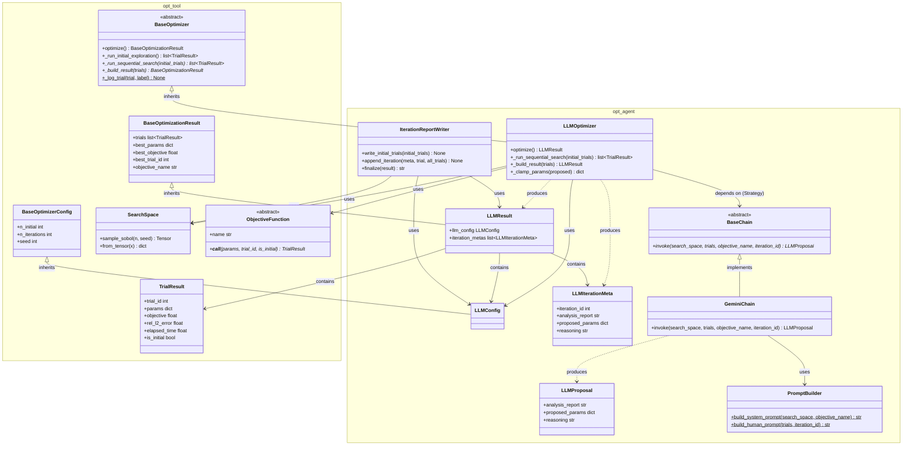

# 実装設計書：LLM-based Hyperparameter Optimizer

## 1. 設計の概要

**手法名**：LLM-based Hyperparameter Optimization（LangChain + Gemini）
**参照ファイル**：本ドキュメントが設計の起点（BO モジュールと比較実験するための新規モジュール）

**設計の方針**
LLM による最適化ループを BOモジュール（`src/bo/`）と同一のインターフェースで提供し、比較実験コードの変更を最小にする。
共通の抽象基底クラス `BaseOptimizer`（`src/opt_tool/base.py`）を Template Method パターンで継承し、Phase 1（Sobol 初期探索）を `BayesianOptimizer` と共有する。
LangChain の呼び出しを `BaseChain` 抽象クラスで隠蔽し、テスト時は `MockChain` に差し替えられる構造とする（Strategy パターン・依存性逆転の原則）。
設定値・推論メタ情報・最適化結果はすべてイミュータブルなデータクラスで管理し、ループ内の副作用を防ぐ。

---

## 2. パブリック API（アルゴリズムステップに基づく）

```python
class LLMOptimizer(BaseOptimizer):
    """
    LLM（Gemini）を用いてハイパーパラメータを最適化するオプティマイザ。
    BayesianOptimizer と同一のインターフェースを提供し、比較実験を容易にする。
    BaseOptimizer を継承し、Phase 1（Sobol 初期探索）を共有する。
    """

    def __init__(
        self,
        search_space: SearchSpace,
        objective: ObjectiveFunction,
        config: LLMConfig = LLMConfig(),
        chain: BaseChain | None = None,         # None の場合 .env から GeminiChain を自動構築
        on_iteration: IterationCallback | None = None,  # 各イテレーション後コールバック
    ) -> None:
        """
        オプティマイザを初期化する。
        chain が None の場合は .env から GEMINI_API_KEY / GEMINI_MODEL_NAME を読み込み、
        GeminiChain を構築する。GEMINI_API_KEY が未設定なら ValueError を送出する。
        """
        ...

    def optimize(self) -> LLMResult:
        """
        最適化ループ全体を実行する（BaseOptimizer.optimize() から継承）。
        Phase 1（Sobol 初期探索）→ Phase 2（LLM 主導探索）→ Phase 3（結果集約）の順に実行する。
        """
        ...
```

---

## 3. クラス設計

### 3-1. クラス一覧

| クラス名 | 配置モジュール | 種別 | 責務（単一責任の原則） | 対応するアルゴリズムの概念 |
|---------|--------------|------|---------------------|-----------------------------|
| `BaseOptimizerConfig` | `opt_tool.base` | frozen dataclass | 共通設定値の保持 | 全フェーズの制御パラメータ基底 |
| `BaseOptimizationResult` | `opt_tool.base` | frozen dataclass | 共通結果フィールドの保持 | Phase 3 出力の基底 |
| `BaseOptimizer` | `opt_tool.base` | 抽象クラス（ABC） | 3 フェーズ最適化ループの骨格定義（Template Method） | Phase 1/2/3 の制御フロー |
| `LLMConfig` | `opt_agent.config` | frozen dataclass | LLM 最適化の設定値保持 | Phase 1/2 の制御パラメータ |
| `LLMIterationMeta` | `opt_agent.config` | frozen dataclass | 1 イテレーション分の LLM 推論メタ情報保持 | Phase 2 の LLM 出力 |
| `LLMResult` | `opt_agent.config` | frozen dataclass | 最適化全体の結果集約 | Phase 3 の出力 |
| `LLMProposal` | `opt_agent.proposal` | Pydantic BaseModel | LLM 構造化出力スキーマの定義と検証 | Phase 2 の LLM 応答パース |
| `BaseChain` | `opt_agent.chain` | 抽象クラス（ABC） | LLM 呼び出しの抽象インターフェース定義 | Phase 2 の LLM 推論 |
| `GeminiChain` | `opt_agent.chain` | 具象クラス | LangChain を使った Gemini API 呼び出し実装 | Phase 2 の LLM 推論（本番） |
| `PromptBuilder` | `opt_agent.prompt` | 具象クラス（静的メソッド） | 探索履歴をプロンプト文字列に変換 | Phase 2 のプロンプト構築 |
| `LLMOptimizer` | `opt_agent.optimizer` | 具象クラス | 最適化ループ全体のオーケストレーション | Phase 1/2/3 の実行制御 |
| `IterationReportWriter` | `opt_agent.report` | 具象クラス | Markdown レポートをイテレーション毎に逐次書き込み | Phase 2 の実行時レポート生成 |
| `IterationCallback` | `opt_agent.optimizer` | 型エイリアス | `on_iteration` コールバックの型定義 | Phase 2 のフック機構 |

---

### 3-2. 各クラスの定義

#### `BaseOptimizerConfig`

**配置**：`opt_tool/base.py`
**種別**：frozen dataclass
**責務**：全オプティマイザ共通の設定値を保持する
**対応するアルゴリズムの概念**：Phase 1/2 の実行回数・乱数シード制御

```python
from dataclasses import dataclass

@dataclass(frozen=True)
class BaseOptimizerConfig:
    n_initial: int = 5       # Sobol 初期探索点数
    n_iterations: int = 20   # 逐次探索イテレーション数
    seed: int = 42           # Sobol サンプリングの乱数シード
```

---

#### `BaseOptimizationResult`

**配置**：`opt_tool/base.py`
**種別**：frozen dataclass
**責務**：全オプティマイザ共通の結果フィールドを保持する
**対応するアルゴリズムの概念**：Phase 3 の出力（共通部分）

```python
@dataclass(frozen=True)
class BaseOptimizationResult:
    trials: list[TrialResult]
    best_params: dict[str, float | int]
    best_objective: float
    best_trial_id: int
    objective_name: str
```

---

#### `BaseOptimizer`

**配置**：`opt_tool/base.py`
**種別**：抽象クラス（ABC）
**責務**：3 フェーズ最適化ループの骨格を定義する（Template Method パターン）
**対応するアルゴリズムの概念**：Phase 1/2/3 の制御フロー

```python
from abc import ABC, abstractmethod

class BaseOptimizer(ABC):
    def __init__(self, search_space: SearchSpace, objective, config: BaseOptimizerConfig) -> None: ...

    def optimize(self) -> BaseOptimizationResult:
        """Phase 1 → Phase 2 → Phase 3 の 3 フェーズをテンプレートとして実行する。"""
        initial_trials = self._run_initial_exploration()
        all_trials = self._run_sequential_search(initial_trials)
        return self._build_result(all_trials)

    def _run_initial_exploration(self) -> list[TrialResult]:
        """Phase 1: Sobol 準乱数で n_initial 点をサンプリングして評価する（共通実装）。"""
        ...

    @abstractmethod
    def _run_sequential_search(self, initial_trials: list[TrialResult]) -> list[TrialResult]: ...

    @abstractmethod
    def _build_result(self, trials: list[TrialResult]) -> BaseOptimizationResult: ...

    @staticmethod
    def _log_trial(trial: TrialResult, label: str) -> None:
        """結果を標準出力にフォーマットして出力する（共通実装）。"""
        ...
```

**SOLIDチェック**
- S: 3 フェーズループの骨格定義のみを責務とする
- O: Phase 2/3 は抽象メソッドで拡張可能（具体実装を変更せずに追加できる）
- D: 具体的なアルゴリズム実装ではなく抽象（ABC）として定義

---

#### `LLMConfig`

**配置**：`opt_agent/config.py`
**種別**：frozen dataclass（`BaseOptimizerConfig` を継承）
**責務**：LLM 最適化ループの制御パラメータを保持する
**対応するアルゴリズムの概念**：Phase 1/2 の実行回数・乱数シード制御

```python
from dataclasses import dataclass
from opt_tool.base import BaseOptimizerConfig

@dataclass(frozen=True)
class LLMConfig(BaseOptimizerConfig):
    # n_initial, n_iterations, seed は BaseOptimizerConfig から継承
    # LLM 固有の追加フィールドなし（BO との公平な比較のため設定を統一）
    pass
```

**SOLIDチェック**
- S: 設定値の保持のみを責務とする
- O: フィールド追加で拡張可能（既存コードの変更不要）
- D: 具体値を保持するため抽象への依存は不要

---

#### `LLMIterationMeta`

**配置**：`opt_agent/config.py`
**種別**：frozen dataclass
**責務**：LLM 主導フェーズの 1 イテレーション分の推論メタ情報を保持する
**対応するアルゴリズムの概念**：Phase 2 の LLM 出力（分析レポート・提案・理由）

```python
@dataclass(frozen=True)
class LLMIterationMeta:
    iteration_id: int                          # イテレーション番号（0 始まり）
    analysis_report: str                       # LLM が生成した現状分析（自然言語）
    proposed_params: dict[str, float | int]    # LLM が提案したパラメータ（実スケール・クランプ済み）
    reasoning: str                             # 提案理由（自然言語）
```

**SOLIDチェック**
- S: 推論メタ情報の保持のみを責務とする
- O: フィールド追加で拡張可能

---

#### `LLMResult`

**配置**：`opt_agent/config.py`
**種別**：frozen dataclass（`BaseOptimizationResult` を継承）
**責務**：最適化全体の結果を集約する
**対応するアルゴリズムの概念**：Phase 3 の出力（BO の `BOResult` に対応）

```python
from opt_tool.base import BaseOptimizationResult

@dataclass(frozen=True)
class LLMResult(BaseOptimizationResult):
    # trials, best_params, best_objective, best_trial_id, objective_name は BaseOptimizationResult から継承
    llm_config: LLMConfig                        # 使用した設定
    iteration_metas: list[LLMIterationMeta]      # LLM 主導フェーズの推論メタ情報
```

**SOLIDチェック**
- S: 結果の集約・保持のみを責務とする
- O: フィールド追加で拡張可能（レポート生成は別クラスが担う）

---

#### `LLMProposal`

**配置**：`opt_agent/proposal.py`
**種別**：Pydantic BaseModel
**責務**：LLM の構造化出力スキーマを定義し、レスポンスのバリデーションを行う
**対応するアルゴリズムの概念**：Phase 2 の LLM 応答パース

```python
from pydantic import BaseModel, Field

class LLMProposal(BaseModel):
    analysis_report: str = Field(description="現在の探索状況の分析（自然言語）")
    proposed_params: dict[str, float | int] = Field(description="次に探索するパラメータ値（実スケール）")
    reasoning: str = Field(description="提案パラメータの選択理由（自然言語）")
```

**SOLIDチェック**
- S: LLM 出力スキーマの定義とバリデーションのみを責務とする
- O: フィールド追加で LLM に要求する情報を拡張可能

---

#### `BaseChain`

**配置**：`opt_agent/chain.py`
**種別**：抽象クラス（ABC）
**責務**：LLM 呼び出しのインターフェースを定義する
**対応するアルゴリズムの概念**：Phase 2 の LLM 推論呼び出し

```python
from abc import ABC, abstractmethod
from opt_tool.space import SearchSpace   # opt_tool から（bo.space ではない）
from opt_tool.result import TrialResult  # opt_tool から（bo.result ではない）

class BaseChain(ABC):
    @abstractmethod
    def invoke(
        self,
        search_space: SearchSpace,
        trials: list[TrialResult],
        objective_name: str,
        iteration_id: int,
    ) -> LLMProposal:
        """現在の探索履歴を受け取り、次の探索点と分析レポートを返す。"""
        ...
```

**SOLIDチェック**
- S: LLM 呼び出しのインターフェース定義のみを責務とする
- O: 新しい LLM（Claude など）は新しい具象クラスを追加するだけで対応可能
- I: 単一メソッド `invoke` のみを要求（最小インターフェース）
- D: `LLMOptimizer` はこの抽象に依存し、具体実装（`GeminiChain`）に依存しない

---

#### `GeminiChain`

**配置**：`opt_agent/chain.py`
**種別**：具象クラス（`BaseChain` のサブクラス）
**責務**：LangChain を使って Gemini API を呼び出し、`LLMProposal` を返す
**対応するアルゴリズムの概念**：Phase 2 の LLM 推論（本番実装）

```python
class GeminiChain(BaseChain):
    def __init__(self, model_name: str, api_key: str) -> None:
        """
        ChatGoogleGenerativeAI と with_structured_output を使って
        LangChain LCEL チェーンを構築する。
        """
        ...

    def invoke(
        self,
        search_space: SearchSpace,
        trials: list[TrialResult],
        objective_name: str,
        iteration_id: int,
    ) -> LLMProposal:
        """
        システムプロンプト（問題設定）+ ユーザーメッセージ（探索履歴）を構築し
        Gemini API に送信する。最大 3 回リトライし、全失敗時は RuntimeError を送出する。
        """
        ...
```

**LangChain 構成**:
- モデル: `ChatGoogleGenerativeAI(model=model_name, google_api_key=api_key)`
- 出力: `llm.with_structured_output(LLMProposal)` で JSON 構造化出力を取得
- プロンプト: `ChatPromptTemplate.from_messages([("system", "{system_prompt}"), ("human", "{human_prompt}")])`
- チェーン: `prompt | llm.with_structured_output(LLMProposal)`（LCEL）

**SOLIDチェック**
- S: Gemini API 呼び出しのみを責務とする
- L: `BaseChain` の契約（`invoke` のシグネチャ）を守る
- D: `PromptBuilder`（具象）に依存するが、テスト時は `MockChain` に差し替え可能

---

#### `PromptBuilder`

**配置**：`opt_agent/prompt.py`
**種別**：具象クラス（静的メソッドのみ）
**責務**：探索空間・履歴・目的関数の情報をプロンプト文字列に変換する
**対応するアルゴリズムの概念**：Phase 2 のプロンプト構築

```python
class PromptBuilder:
    @staticmethod
    def build_system_prompt(
        search_space: SearchSpace,
        objective_name: str,
    ) -> str:
        """
        問題設定を記述したシステムプロンプトを構築する。
        含む情報: タスク説明、探索空間の各パラメータ（名前・型・範囲・スケール）、
        目的関数の説明、出力フォーマットの指定。
        """
        ...

    @staticmethod
    def build_human_prompt(
        trials: list[TrialResult],
        iteration_id: int,
    ) -> str:
        """
        現在の探索履歴を記述したユーザーメッセージを構築する。
        含む情報: 現在のイテレーション番号、全トライアル結果テーブル、現在の最良点。
        """
        ...
```

**SOLIDチェック**
- S: プロンプト文字列の構築のみを責務とする（API 呼び出しは `GeminiChain` が担う）
- O: プロンプト内容の変更はこのクラスの変更だけで済む

---

#### `LLMOptimizer`

**配置**：`opt_agent/optimizer.py`
**種別**：具象クラス（`BaseOptimizer` を継承）
**責務**：最適化ループ全体のオーケストレーションと依存クラスの組み立て（Facade）
**対応するアルゴリズムの概念**：Phase 1/2/3 の実行制御

```python
from opt_tool.base import BaseOptimizer

IterationCallback = Callable[[LLMIterationMeta, TrialResult, list[TrialResult]], None]

class LLMOptimizer(BaseOptimizer):
    def __init__(
        self,
        search_space: SearchSpace,
        objective,
        config: LLMConfig = LLMConfig(),
        chain: BaseChain | None = None,
        on_iteration: IterationCallback | None = None,
    ) -> None: ...

    def _run_sequential_search(self, initial_trials: list[TrialResult]) -> list[TrialResult]:
        """Phase 2: LLM に n_iterations 回提案させて評価する。
        - クランプ・丸め: _clamp_params() でパラメータを SearchSpace 境界値に制限する
        - コールバック: 各イテレーション後に on_iteration を呼び出す（省略可）
        - 推論メタ: LLMIterationMeta を self._metas に蓄積する
        """
        ...

    def _build_result(self, trials: list[TrialResult]) -> LLMResult:
        """Phase 3: 最良点を選択して LLMResult を生成する。"""
        ...

    def _clamp_params(self, proposed: dict[str, float | int]) -> dict[str, float | int]:
        """LLM 提案値を SearchSpace 境界値にクランプし、整数パラメータを int() で丸める。"""
        ...
```

**SOLIDチェック**
- S: 最適化ループの制御と依存組み立てのみを責務とする
- O: 新しいフェーズは新メソッドの追加で対応
- D: `BaseChain`（抽象）に依存（`GeminiChain` の具体実装には依存しない）

---

#### `IterationReportWriter`

**配置**：`opt_agent/report.py`
**種別**：具象クラス
**責務**：最適化の進行に合わせて `opt_agent_report.md` を逐次書き込む
**対応するアルゴリズムの概念**：Phase 2 の実行時レポート生成

```python
class IterationReportWriter:
    def __init__(
        self,
        output_dir: str,
        search_space: SearchSpace,
        llm_config: LLMConfig,
        objective_name: str,
    ) -> None:
        """レポートファイルを作成し、ヘッダー（タイムスタンプ・設定・探索空間）を書き込む。"""
        ...

    def write_initial_trials(self, initial_trials: list[TrialResult]) -> None:
        """Phase 1（Sobol）の結果テーブルをファイルに追記する。"""
        ...

    def append_iteration(
        self,
        meta: LLMIterationMeta,
        trial: TrialResult,
        all_trials: list[TrialResult],
    ) -> None:
        """1 イテレーション分のセクション（分析・提案・評価結果）を追記する。
        on_iteration コールバックとして LLMOptimizer に直接渡せる。
        """
        ...

    def finalize(self, result: LLMResult) -> str:
        """最終ベスト結果サマリーと収束テーブルを追記し、ファイルパスを返す。"""
        ...
```

**BO の `ReportGenerator` との違い**:
`ReportGenerator`（`bo/report.py`）は `optimize()` 完了後に一括でレポートを生成するが、
`IterationReportWriter` は各イテレーション後に逐次ファイルへ書き込む。
LLM 最適化は実行時間が長いため、途中で中断しても部分結果が読める設計にしている。

**SOLIDチェック**
- S: Markdown レポートのファイル出力のみを責務とする
- O: 各フェーズに対応するメソッドを追加することで拡張可能

---

## 4. デザインパターン

| パターン名 | 適用箇所（クラス名） | 採用理由 |
|-----------|-------------------|---------|
| Template Method | `BaseOptimizer` → `LLMOptimizer` | Phase 1 を `BayesianOptimizer` と共有し、Phase 2/3 のみ LLM 固有実装に差し替えるため |
| Strategy | `BaseChain`, `GeminiChain` | LLM の種類をテスト時に差し替えられるようにするため |
| Facade | `LLMOptimizer` | 複数の内部クラスを単一の `optimize()` API に集約し、利用側の複雑性を隠蔽するため |
| Value Object（データクラス） | `LLMConfig`, `LLMIterationMeta`, `LLMResult` | 設定・推論結果は不変であるべきで、データの保持が責務であることを明示するため |

### Template Method パターンの詳細

**適用箇所**：`BaseOptimizer` → `LLMOptimizer`（および `BayesianOptimizer`）
**採用理由**：Phase 1（Sobol 準乱数サンプリング）は `BayesianOptimizer` と `LLMOptimizer` で完全に同一のロジックであるため、`BaseOptimizer._run_initial_exploration()` として共通実装した。Phase 2（GP 探索 vs LLM 探索）と Phase 3（BOResult vs LLMResult の生成）のみを抽象メソッドとして各サブクラスが実装する。
**代替案と却下理由**：`LLMOptimizer` が独立した `_run_initial_exploration()` を持つ案は、Phase 1 コードの重複が生じるため却下した。

### Strategy パターンの詳細

**適用箇所**：`BaseChain` → `GeminiChain`
**採用理由**：LLM の種類（Gemini / Claude / Mock）を `LLMOptimizer` から切り離すことで、テスト時に API を呼び出さない `MockChain` に差し替えられる。Gemini から別モデルへの変更も `GeminiChain` の置き換えのみで対応できる。
**代替案と却下理由**：`LLMOptimizer` 内に直接 Gemini 呼び出しを埋め込む案は、単体テストで Gemini API への実呼び出しが発生しテストが不安定になるため却下した。

### Facade パターンの詳細

**適用箇所**：`LLMOptimizer`
**採用理由**：`GeminiChain`・`PromptBuilder`・`SearchSpace`・`ObjectiveFunction` を利用者が直接組み立てる必要がなく、`LLMOptimizer(search_space, objective).optimize()` の 1 呼び出しで完結させる。BO モジュールの `BayesianOptimizer` と同一の使い方ができるため比較実験コードが簡潔になる。
**代替案と却下理由**：依存性注入のみで Facade を設けない案は、利用者が内部クラスの組み立て順序を知る必要が生じるため却下した。

---

## 5. クラス図（Mermaid）



---

## 6. 依存ライブラリ

| ライブラリ | 用途 | 対応する処理 |
|-----------|------|------------|
| `langchain-google-genai` | `ChatGoogleGenerativeAI` によるGemini との通信 | Phase 2 LLM 呼び出し |
| `langchain-core` | `ChatPromptTemplate`, LCEL（`\|` 演算子）, `with_structured_output` | Phase 2 チェーン構築・プロンプト構築 |
| `python-dotenv` | `.env` ファイルからの `GEMINI_API_KEY` / `GEMINI_MODEL_NAME` 読み込み | `LLMOptimizer.__init__` での環境変数取得 |
| `pydantic` | `LLMProposal` の構造化出力スキーマ定義とバリデーション | Phase 2 LLM 応答パース |

---

## 7. 実装上の注意点

| 項目 | 内容 | 対応するクラス / メソッド |
|------|------|----------------------|
| パラメータのクランプ | LLM が探索範囲外の値を提案した場合、`SearchSpace` の境界値にクランプしてから評価する | `LLMOptimizer._clamp_params` |
| 整数パラメータの丸め | `n_hidden_layers`, `n_neurons`, `epochs_adam` など `param_type="int"` のパラメータは `int()` で丸める | `LLMOptimizer._clamp_params` |
| API エラーハンドリング | Gemini API 呼び出し失敗時は最大 3 回リトライし、失敗した場合は `RuntimeError` を送出する | `GeminiChain.invoke` |
| テスト時の差し替え | `LLMOptimizer(chain=MockChain())` のように `chain` 引数で差し替える | `LLMOptimizer.__init__` |
| 環境変数の未設定 | `GEMINI_API_KEY` が未設定の場合は `ValueError` を送出する | `LLMOptimizer.__init__` |
| `on_iteration` コールバック | Phase 2 の各イテレーション後に呼び出されるフック。`IterationReportWriter.append_iteration` を渡すことで逐次レポートを生成できる | `LLMOptimizer.__init__` |
| Phase 1 の共有 | `_run_initial_exploration` は `BaseOptimizer` に実装済みで、`LLMOptimizer` はオーバーライドしない | `BaseOptimizer._run_initial_exploration` |
| `_metas` の一時保存 | `_run_sequential_search` が `LLMIterationMeta` を `self._metas` に蓄積し、`_build_result` が参照する | `LLMOptimizer._run_sequential_search`, `_build_result` |
| 逐次レポートと一括レポートの違い | `IterationReportWriter`（`opt_agent`）は実行中に逐次書き込み。`ReportGenerator`（`bo`）は `optimize()` 完了後に一括生成 | `IterationReportWriter`, `bo.ReportGenerator` |

---

## 8. `.env` 仕様

```dotenv
GEMINI_API_KEY=<your_api_key>
GEMINI_MODEL_NAME=gemini-2.0-flash
```

`python-dotenv` の `load_dotenv()` で読み込み、`GeminiChain.__init__` に渡す。

---

## 9. BO との比較設計

LLM 最適化は以下の条件を BO と完全に揃えて公平な比較を行う。

| 条件 | 値 |
|------|-----|
| 初期探索点 | Sobol（`n_initial=5`, `seed=42`） |
| イテレーション数 | `n_iterations=20` |
| 目的関数 | `AccuracyObjective` または `AccuracySpeedObjective` |
| 探索空間 | 4次元（`n_hidden_layers`, `n_neurons`, `lr`, `epochs_adam`） |
| 結果データ構造 | `TrialResult`（`opt_tool` で共有） |
| Phase 1 実装 | `BaseOptimizer._run_initial_exploration`（両者で共通） |
