# リファクタリング設計書：bo / opt_agent 共通化

## 1. 目的

`src/bo/`（ベイズ最適化）と `src/opt_agent/`（LLM最適化）の2モジュールには、
同一の処理が重複している。本リファクタリングでは以下の2点を実現する。

1. **共通部分の抽出**：重複コードを新モジュール `src/opt_tool/` に集約する
2. **統一API**：両オプティマイザを同じシグネチャで呼び出せるようにする

---

## 2. 現状分析

### 2-1. 共通部分（重複している）

| 重複箇所 | bo モジュール | opt_agent モジュール |
|---|---|---|
| 3フェーズループの骨格 | `BayesianOptimizer.optimize()` | `LLMOptimizer.optimize()` |
| Phase 1 Sobol 初期探索 | インライン実装 | `_run_initial_exploration()` |
| Phase 3 最良試行選択 | `max(trials, key=...)` | `_aggregate_results()` |
| `_log_trial()` | インスタンスメソッド | staticメソッド（書式が微妙に異なる） |
| 設定フィールド | `n_initial`, `n_iterations`, `seed` | 同左 |
| 結果フィールド | `trials`, `best_params`, `best_objective`, `best_trial_id`, `objective_name` | 同左 |
| 検索空間テーブル生成 | `report.py` 内に直書き | `report.py` 内に直書き（同一コード） |
| 収束テーブル生成 | `report.py` 内に直書き | `report.py` 内に直書き（同一ロジック） |

### 2-2. 共有されているが `bo/` に置かれているもの（問題）

現在 `opt_agent` は `bo` から以下をインポートしており、
ベイズ最適化固有ではない概念が `bo/` に混在している。

| クラス | 現在の場所 | 問題 |
|---|---|---|
| `TrialResult` | `bo/result.py` | 単一試行の結果を表す汎用データクラス。BO固有ではない |
| `SearchSpace`, `HyperParameter` | `bo/space.py` | 探索空間の定義。どちらの最適化にも使う汎用概念 |
| `ObjectiveFunction` | `bo/objective.py` | 目的関数の抽象基底クラス。BO固有ではない |

`opt_agent` がこれらを `bo` から直接インポートするのは、
依存関係として不自然である（LLM最適化がベイズ最適化に依存することになる）。

### 2-3. 差異（変更しない）

| 差異 | bo | opt_agent |
|---|---|---|
| Phase 2 探索戦略 | SingleTaskGP + 獲得関数最適化 | LLM（Gemini）への提案依頼 |
| 設定の固有フィールド | `acquisition`, `ucb_beta`, `num_restarts`, `raw_samples` | なし（共通フィールドのみ） |
| 結果の固有フィールド | `bo_config` | `llm_config`, `iteration_metas` |
| レポートの生成タイミング | 最適化終了後に一括生成 | 各イテレーション後にストリーミング書き込み |
| イテレーションコールバック | なし | `on_iteration` コールバック |

---

## 3. リファクタリング方針

### 3-1. 新モジュール `src/opt_tool/` の導入

`bo/` と `opt_agent/` のどちらにも属さない共通概念を `opt_tool/` に集約する。
`opt_tool/` は他のモジュールに依存しない、依存グラフの根となる層とする。

```
opt_tool/   ← 共通抽象層（他のsrcモジュールに依存しない）
    ↑               ↑
   bo/          opt_agent/
（BO固有）      （LLM固有）
```

### 3-2. `src/opt_tool/` のファイル構成

```
src/opt_tool/
├── __init__.py
├── base.py          # BaseOptimizerConfig, BaseOptimizationResult, BaseOptimizer
├── objective.py     # ObjectiveFunction（bo/objective.py から移動）
├── result.py        # TrialResult（bo/result.py から移動）
├── space.py         # SearchSpace, HyperParameter（bo/space.py から移動）
└── report_utils.py  # 共通レポートユーティリティ（新規）
```

### 3-3. 各ファイルの定義

#### `opt_tool/result.py`

`bo/result.py` から `TrialResult` を移動する。

```python
# Pydantic BaseModel のまま維持（外部データのバリデーションに使用）
class TrialResult(BaseModel):
    trial_id: int
    params: dict[str, float | int]
    objective: float
    rel_l2_error: float
    elapsed_time: float
    is_initial: bool
```

#### `opt_tool/space.py`

`bo/space.py` から `SearchSpace`、`HyperParameter` を移動する。

#### `opt_tool/objective.py`

`bo/objective.py` から `ObjectiveFunction` 抽象基底クラスを移動する。
PINN固有の実装（`AccuracyObjective` 等）は `bo/objective.py` に残す。

#### `opt_tool/base.py`

共通の設定・結果・オプティマイザ基底クラスを定義する。

```python
@dataclass(frozen=True)
class BaseOptimizerConfig:
    n_initial: int = 5
    n_iterations: int = 20
    seed: int = 42


@dataclass(frozen=True)
class BaseOptimizationResult:
    trials: list[TrialResult]
    best_params: dict[str, float | int]
    best_objective: float
    best_trial_id: int
    objective_name: str


class BaseOptimizer(ABC):
    """Template Methodパターンによる3フェーズ最適化の骨格。"""

    def __init__(
        self,
        search_space: SearchSpace,
        objective: ObjectiveFunction,
        config: BaseOptimizerConfig,
    ) -> None: ...

    def optimize(self) -> BaseOptimizationResult:
        # Phase 1: Sobol初期探索（共通実装）
        initial_trials = self._run_initial_exploration()
        # Phase 2: 逐次探索（サブクラスが実装）
        all_trials = self._run_sequential_search(initial_trials)
        # Phase 3: 結果集約（サブクラスが実装）
        return self._build_result(all_trials)

    def _run_initial_exploration(self) -> list[TrialResult]:
        """Phase 1: Sobolサンプリングと評価（共通実装）"""
        ...

    @abstractmethod
    def _run_sequential_search(
        self, initial_trials: list[TrialResult]
    ) -> list[TrialResult]: ...

    @abstractmethod
    def _build_result(
        self, trials: list[TrialResult]
    ) -> BaseOptimizationResult: ...

    @staticmethod
    def _log_trial(trial: TrialResult, label: str) -> None:
        """統一されたトライアルログ出力"""
        ...
```

#### `opt_tool/report_utils.py`

両レポートで重複している関数を抽出する。

```python
def build_search_space_table(search_space: SearchSpace) -> str:
    """検索空間の Markdown テーブルを生成する"""
    ...

def build_convergence_table(trials: list[TrialResult]) -> str:
    """収束テーブル（累積最大 objective）を生成する"""
    ...

def build_best_result_section(
    best_trial: TrialResult,
    best_params: dict[str, float | int],
) -> str:
    """最良結果セクションを生成する"""
    ...
```

### 3-4. 設定クラスの統一

`BOConfig` を Pydantic BaseModel から `@dataclass(frozen=True)` に変更し、
`BaseOptimizerConfig` を継承させる。`LLMConfig` は既に dataclass であるため変更なし。

```python
# bo/result.py（変更後）
from opt_tool.base import BaseOptimizerConfig

@dataclass(frozen=True)
class BOConfig(BaseOptimizerConfig):
    acquisition: Literal["EI", "UCB"] = "EI"
    ucb_beta: float = 2.0
    num_restarts: int = 10
    raw_samples: int = 512

# opt_agent/config.py（変更後）
from opt_tool.base import BaseOptimizerConfig

@dataclass(frozen=True)
class LLMConfig(BaseOptimizerConfig):
    pass  # 共通フィールドのみ
```

### 3-5. 結果クラスの統一

```python
# bo/result.py（変更後）
from opt_tool.base import BaseOptimizationResult

@dataclass(frozen=True)
class BOResult(BaseOptimizationResult):
    bo_config: BOConfig

# opt_agent/config.py（変更後）
from opt_tool.base import BaseOptimizationResult

@dataclass(frozen=True)
class LLMResult(BaseOptimizationResult):
    llm_config: LLMConfig
    iteration_metas: list[LLMIterationMeta]
```

### 3-6. オプティマイザクラスの継承

```python
# bo/optimizer.py（変更後）
from opt_tool.base import BaseOptimizer

class BayesianOptimizer(BaseOptimizer):
    def __init__(self, search_space, objective, config: BOConfig) -> None: ...

    def _run_sequential_search(self, initial_trials) -> list[TrialResult]:
        """Phase 2: GP-guided search（BoTorch固有の実装）"""
        ...

    def _build_result(self, trials) -> BOResult: ...


# opt_agent/optimizer.py（変更後）
from opt_tool.base import BaseOptimizer

class LLMOptimizer(BaseOptimizer):
    def __init__(
        self,
        search_space,
        objective,
        config: LLMConfig = LLMConfig(),
        chain: BaseChain | None = None,
        on_iteration: IterationCallback | None = None,
    ) -> None: ...

    def _run_sequential_search(self, initial_trials) -> list[TrialResult]:
        """Phase 2: LLM-guided search（Gemini固有の実装）"""
        ...

    def _build_result(self, trials) -> LLMResult: ...
```

---

## 4. 変更ファイル一覧

### 新規作成

| ファイル | 内容 |
|---|---|
| `opt_tool/__init__.py` | パブリックAPI定義 |
| `opt_tool/base.py` | `BaseOptimizerConfig`, `BaseOptimizationResult`, `BaseOptimizer` |
| `opt_tool/result.py` | `TrialResult`（`bo/result.py` から移動） |
| `opt_tool/space.py` | `SearchSpace`, `HyperParameter`（`bo/space.py` から移動） |
| `opt_tool/objective.py` | `ObjectiveFunction` 抽象基底クラス（`bo/objective.py` から分離） |
| `opt_tool/report_utils.py` | `build_search_space_table`, `build_convergence_table`, `build_best_result_section` |

### 変更

| ファイル | 変更内容 |
|---|---|
| `bo/result.py` | `TrialResult` を削除（`opt_tool` へ移動）。`BOConfig` を dataclass 化・`BaseOptimizerConfig` 継承。`BOResult` を `BaseOptimizationResult` 継承 |
| `bo/space.py` | `SearchSpace`, `HyperParameter` を削除（`opt_tool` へ移動）。後方互換のため `from opt_tool.space import *` を残す |
| `bo/objective.py` | `ObjectiveFunction` を `opt_tool.objective` から import。`AccuracyObjective` 等の具体実装はここに残す |
| `bo/optimizer.py` | `BaseOptimizer` を継承。`_log_trial` を親クラスに委譲。Phase 1 を親クラスに委譲 |
| `bo/report.py` | `opt_tool.report_utils` の共通関数を使用 |
| `bo/__init__.py` | インポート元を `opt_tool` に更新 |
| `opt_agent/config.py` | `LLMConfig` が `BaseOptimizerConfig` 継承。`LLMResult` が `BaseOptimizationResult` 継承 |
| `opt_agent/optimizer.py` | `BaseOptimizer` を継承。Phase 1 を親クラスに委譲。`bo.*` からのインポートを `opt_tool.*` に変更 |
| `opt_agent/report.py` | `opt_tool.report_utils` の共通関数を使用。`bo.*` からのインポートを `opt_tool.*` に変更 |
| `opt_agent/chain.py` | `bo.*` からのインポートを `opt_tool.*` に変更 |
| `opt_agent/prompt.py` | `bo.*` からのインポートを `opt_tool.*` に変更 |
| `opt_agent/__init__.py` | インポート元を `opt_tool` に更新 |

---

## 5. 新しいAPI

```python
from opt_tool.base import BaseOptimizer, BaseOptimizationResult
from opt_tool.space import SearchSpace, HyperParameter
from opt_tool.result import TrialResult

from bo import BayesianOptimizer, BOConfig
from opt_agent import LLMOptimizer, LLMConfig

# 共通の型シグネチャで呼び出せる
def run_optimizer(optimizer: BaseOptimizer) -> BaseOptimizationResult:
    return optimizer.optimize()

# BO
bo_result = BayesianOptimizer(
    search_space=search_space,
    objective=objective,
    config=BOConfig(n_initial=5, n_iterations=20, acquisition="EI"),
).optimize()  # → BOResult

# LLM（同じパターン）
llm_result = LLMOptimizer(
    search_space=search_space,
    objective=objective,
    config=LLMConfig(n_initial=5, n_iterations=20),
).optimize()  # → LLMResult

# 共通フィールドへのアクセスは同一
bo_result.best_params    # dict[str, float | int]
llm_result.best_params   # dict[str, float | int]
```

---

## 6. クラス図（Mermaid）

```mermaid
classDiagram
    namespace opt_tool {
        class BaseOptimizerConfig {
            <<dataclass, frozen>>
            +n_initial: int
            +n_iterations: int
            +seed: int
        }
        class BaseOptimizationResult {
            <<dataclass, frozen>>
            +trials: list[TrialResult]
            +best_params: dict
            +best_objective: float
            +best_trial_id: int
            +objective_name: str
        }
        class BaseOptimizer {
            <<abstract>>
            +optimize() BaseOptimizationResult
            #_run_initial_exploration() list[TrialResult]
            #_run_sequential_search(initial_trials)* list[TrialResult]
            #_build_result(trials)* BaseOptimizationResult
            +_log_trial(trial, label)$ void
        }
        class TrialResult {
            <<Pydantic, frozen>>
            +trial_id: int
            +params: dict
            +objective: float
            +rel_l2_error: float
            +elapsed_time: float
            +is_initial: bool
        }
        class SearchSpace {
            <<Pydantic, frozen>>
            +parameters: list[HyperParameter]
            +sample_sobol(n, seed) Tensor
            +to_tensor(params) Tensor
            +from_tensor(x) dict
        }
        class ObjectiveFunction {
            <<abstract>>
            +name: str
            +__call__(params, trial_id, is_initial) TrialResult
        }
    }

    namespace bo {
        class BOConfig {
            <<dataclass, frozen>>
            +acquisition: str
            +ucb_beta: float
            +num_restarts: int
            +raw_samples: int
        }
        class BOResult {
            <<dataclass, frozen>>
            +bo_config: BOConfig
        }
        class BayesianOptimizer {
            #_run_sequential_search(initial_trials) list[TrialResult]
            #_build_result(trials) BOResult
        }
    }

    namespace opt_agent {
        class LLMConfig {
            <<dataclass, frozen>>
        }
        class LLMResult {
            <<dataclass, frozen>>
            +llm_config: LLMConfig
            +iteration_metas: list[LLMIterationMeta]
        }
        class LLMOptimizer {
            -_chain: BaseChain
            -_on_iteration: IterationCallback
            #_run_sequential_search(initial_trials) list[TrialResult]
            #_build_result(trials) LLMResult
        }
    }

    BaseOptimizerConfig <|-- BOConfig : extends
    BaseOptimizerConfig <|-- LLMConfig : extends
    BaseOptimizationResult <|-- BOResult : extends
    BaseOptimizationResult <|-- LLMResult : extends
    BaseOptimizer <|-- BayesianOptimizer : extends
    BaseOptimizer <|-- LLMOptimizer : extends
```



---

## 7. 移行時の注意点

### `bo/space.py` の後方互換

`SearchSpace` を `opt_tool` に移動した後、`bo/space.py` に以下を残すことで
既存コードへの影響を最小化できる。

```python
# bo/space.py（移行後）
# 後方互換のための再エクスポート
from opt_tool.space import HyperParameter, SearchSpace

__all__ = ["HyperParameter", "SearchSpace"]
```

### `BOConfig` の Pydantic → dataclass 変換

- **変更前**: `BOConfig(n_initial=5)` では Pydantic のバリデーションが走る
- **変更後**: `@dataclass(frozen=True)` では型チェックなし
- **対応**: 値域チェックが必要であれば `__post_init__` に `assert` を追加する
- `result.model_dump()` 等の Pydantic メソッドを使っている箇所は修正が必要

### `pyproject.toml` への `opt_tool` の追加

```toml
[project]
packages = [
    {include = "PINNs_Burgers", from = "src"},
    {include = "bo", from = "src"},
    {include = "opt_agent", from = "src"},
    {include = "opt_tool", from = "src"},   # 追加
]
```

---

## 8. テスト互換性設計

テストコードは一切変更せず、既存のテストがリファクタリング後も通過できるよう
コード実装の設計上の制約を定める。

### 8-1. テストファイルのインポートパターン

| テストファイル | `bo` からのインポート | `opt_agent` からのインポート |
|---|---|---|
| `test_bo_algorithm.py` | `BOConfig, BOResult, BayesianOptimizer, HyperParameter, ReportGenerator, SearchSpace, TrialResult` | — |
| `test_bo_theory.py` | `BOConfig, BOResult, BayesianOptimizer, HyperParameter, SearchSpace, TrialResult` | — |
| `test_llm_algorithm.py` | `HyperParameter, SearchSpace, TrialResult` | `BaseChain, LLMConfig, LLMIterationMeta, LLMOptimizer, LLMProposal, LLMResult, PromptBuilder` |
| `test_llm_theory.py` | `HyperParameter, SearchSpace, TrialResult` | `BaseChain, LLMConfig, LLMOptimizer, LLMProposal, PromptBuilder` |

`test_llm_*` も `HyperParameter`, `SearchSpace`, `TrialResult` を **`bo` から** インポートしている。
リファクタリング後、これらは `opt_tool/` に移動するが、テストコードは修正しない。

### 8-2. `bo/__init__.py` の必須エクスポート

移動後のクラスを `opt_tool/` から再エクスポートすることで、既存のインポートパスを維持する。

```python
# bo/__init__.py（変更後）
from opt_tool.objective import ObjectiveFunction
from opt_tool.result import TrialResult                     # opt_tool から再エクスポート
from opt_tool.space import HyperParameter, SearchSpace      # opt_tool から再エクスポート
from bo.objective import AccuracyObjective, AccuracySpeedObjective
from bo.optimizer import BayesianOptimizer
from bo.report import ReportGenerator
from bo.result import BOConfig, BOResult

__all__ = [
    "SearchSpace", "HyperParameter", "ObjectiveFunction",
    "AccuracyObjective", "AccuracySpeedObjective",
    "BayesianOptimizer", "BOConfig", "BOResult", "TrialResult",
    "ReportGenerator",
]
```

`from bo import TrialResult, SearchSpace, HyperParameter` という既存のインポートが
リファクタリング後も破綻しないことが保証される。

### 8-3. 凍結チェックテストと例外型の互換性

テストは以下のように `ValidationError` と `TypeError` の両方を受け付けている。

```python
# ALG-BO-11: TrialResult の frozen テスト
with pytest.raises((ValidationError, TypeError)):
    trial.objective = 1.0

# ALG-BO-13: BOResult の frozen テスト
with pytest.raises((ValidationError, TypeError)):
    result.best_objective = 0.0

# ALG-LLM-02: LLMConfig の frozen テスト
with pytest.raises((dataclasses.FrozenInstanceError, TypeError)):
    cfg.n_initial = 99

# ALG-LLM-06: LLMResult の frozen テスト
with pytest.raises((dataclasses.FrozenInstanceError, TypeError)):
    result.best_objective = 99.0
```

**変換後の例外型の対応:**

| クラス | 変換前 | 変換後 | 送出される例外 | テストとの互換性 |
|---|---|---|---|---|
| `TrialResult` | Pydantic `BaseModel` | 変更なし（Pydantic） | `ValidationError` | ✅（`(ValidationError, TypeError)` に含まれる） |
| `BOConfig` | Pydantic `BaseModel` | `@dataclass(frozen=True)` | `FrozenInstanceError`（≒`TypeError`） | ✅（`(ValidationError, TypeError)` に含まれる） |
| `BOResult` | Pydantic `BaseModel` | `@dataclass(frozen=True)` | `FrozenInstanceError`（≒`TypeError`） | ✅（`(ValidationError, TypeError)` に含まれる） |
| `LLMConfig` | `@dataclass(frozen=True)` | 変更なし | `FrozenInstanceError` | ✅（変更なし） |
| `LLMResult` | `@dataclass(frozen=True)` | `@dataclass(frozen=True)` 継承 | `FrozenInstanceError` | ✅（変更なし） |

`dataclasses.FrozenInstanceError` は `AttributeError` のサブクラスであり `TypeError` ではないが、
テスト ALG-LLM-02・ALG-LLM-06 は `(dataclasses.FrozenInstanceError, TypeError)` で両方を捕捉しており、
変換後も通過する。

### 8-4. `bo.objective` のパッチパス

`test_bo_theory.py` は `unittest.mock.patch` で以下をパッチしている。

```python
patch("bo.objective.BurgersPINNSolver")
patch("bo.objective.time.perf_counter")
```

**要件**: `AccuracySpeedObjective` は `bo/objective.py` に留まること。

`ObjectiveFunction` 抽象基底クラスのみを `opt_tool/objective.py` に移動し、
`AccuracyObjective`, `AccuracySpeedObjective` などの具体実装は `bo/objective.py` に残す。
これにより `"bo.objective.BurgersPINNSolver"` パッチパスは変更不要。

### 8-5. `BOResult` の dataclass 化とフィールド順

テストはすべてキーワード引数で `BOResult` を構築している。

```python
# test_bo_algorithm.py 内の使用例
BOResult(
    trials=trials,
    best_params=best.params,
    best_objective=best.objective,
    best_trial_id=best.trial_id,
    bo_config=cfg,
    objective_name="mock",
)
```

`@dataclass` 継承でのフィールド順の制約（デフォルト値なしフィールドがデフォルト値ありフィールドより後に来れない）を
回避するため、`BaseOptimizationResult` のすべてのフィールドはデフォルト値を持たない設計とする。

```python
@dataclass(frozen=True)
class BaseOptimizationResult:
    trials: list[TrialResult]           # デフォルトなし
    best_params: dict[str, float | int] # デフォルトなし
    best_objective: float               # デフォルトなし
    best_trial_id: int                  # デフォルトなし
    objective_name: str                 # デフォルトなし

@dataclass(frozen=True)
class BOResult(BaseOptimizationResult):
    bo_config: BOConfig                 # デフォルトなし（追加フィールド）
```

### 8-6. `LLMResult` のフィールド構造変更

現在の `LLMResult` と変更後のフィールド対応：

| フィールド | 現在 | 変更後 | テスト影響 |
|---|---|---|---|
| `trials` | `LLMResult` 直接定義 | `BaseOptimizationResult` から継承 | なし |
| `best_params` | `LLMResult` 直接定義 | `BaseOptimizationResult` から継承 | なし |
| `best_objective` | `LLMResult` 直接定義 | `BaseOptimizationResult` から継承 | なし |
| `best_trial_id` | `LLMResult` 直接定義 | `BaseOptimizationResult` から継承 | なし |
| `objective_name` | `LLMResult` 直接定義 | `BaseOptimizationResult` から継承 | なし |
| `llm_config` | `LLMResult` 固有フィールド | `LLMResult` 固有フィールド（変更なし） | なし |
| `iteration_metas` | `LLMResult` 固有フィールド | `LLMResult` 固有フィールド（変更なし） | なし |

すべてのテストがキーワード引数で構築しているため、フィールド順の変更は問題なし。

### 8-7. `BaseChain.invoke` シグネチャの `SearchSpace` 型

`opt_agent/chain.py` の `BaseChain.invoke` は現在 `from bo.space import SearchSpace` を参照している。
変更後は `from opt_tool.space import SearchSpace` を参照するが、`bo/__init__.py` の再エクスポートにより
`from bo import SearchSpace` で得られるオブジェクトは同一クラスであるため、
`MockChain.invoke` のシグネチャ互換性は維持される。

### 8-8. テスト全通過のための実装チェックリスト

リファクタリング実装時に確認すべき項目：

- [ ] `bo/__init__.py` が `TrialResult`, `SearchSpace`, `HyperParameter` を `opt_tool` から再エクスポートしている
- [ ] `AccuracyObjective`, `AccuracySpeedObjective` が `bo/objective.py` に残っている
- [ ] `patch("bo.objective.BurgersPINNSolver")` が有効なパッチパスである
- [ ] `BOConfig`, `BOResult` が `@dataclass(frozen=True)` に変換されている
- [ ] `BOResult` のフィールド順がデフォルト値なし → デフォルト値あり の順になっている
- [ ] `TrialResult` が Pydantic `BaseModel` のまま維持されている（ValidationError を送出すること）
- [ ] `LLMResult` が引き続き `@dataclass(frozen=True)` として動作する（`FrozenInstanceError` を送出すること）
- [ ] `LLMConfig` のフィールド名 `n_initial`, `n_iterations`, `seed` とデフォルト値が変更されていない
- [ ] `opt_agent/__init__.py` が `BaseChain`, `LLMConfig`, `LLMIterationMeta`, `LLMOptimizer`, `LLMProposal`, `LLMResult`, `PromptBuilder` を引き続きエクスポートしている
